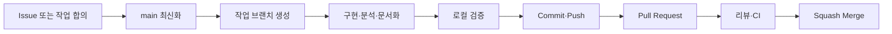

# PlaylistPro Insight 협업 가이드

이 문서는 `SKN33-2nd-3Team/Team3-2nd-Project`에서 함께 작업할 때 사용하는 GitHub 협업 규칙입니다.

> 운영 방식: `main` 보호 + 짧은 작업 브랜치 + 작은 커밋 + Pull Request 리뷰

## 1. 한눈에 보는 작업 흐름



| 항목 | 팀 규칙 |
|---|---|
| 기준 브랜치 | `main` |
| `main` 직접 push | 금지 |
| 작업 단위 | 한 브랜치·한 PR에 한 가지 목적 |
| 리뷰 | 최소 1명 승인 권장 |
| 병합 | `Squash and merge` 권장 |
| 보안 | 비밀키·개인정보·가상환경·불필요한 대용량 파일 커밋 금지 |
| ML 검증 | Test 결과를 보고 모델·파라미터·threshold를 다시 선택하지 않음 |

## 2. 브랜치 네이밍

구분자 `/`를 사용해 브랜치 목적을 표현합니다.

| 형식 | 용도 | 예시 |
|---|---|---|
| `feature/기능이름` | 기능·분석·모델 실험 추가 | `feature/churn-eda`, `feature/xgboost-model` |
| `fix/버그이름` | 버그·오류 수정 | `fix/feature-order` |
| `docs/문서작업` | README·보고서·발표자료 | `docs/git-convention` |

권장 규칙:

- 설명은 영문 소문자와 하이픈을 사용합니다.
- `final`, `test2`, `my-branch`처럼 목적이 모호한 이름은 사용하지 않습니다.
- 병합된 브랜치는 재사용하지 않습니다.
- 동일 파일을 여러 브랜치에서 동시에 크게 수정해야 한다면 먼저 팀에 공유합니다.

## 3. 커밋 메시지

형식은 다음과 같습니다. 대괄호는 작성 형식을 설명하기 위한 표시이며 실제 메시지에는 넣지 않습니다.

```text
type: 변경 내용을 설명하는 짧은 문장
```

| Type | 의미 | 예시 |
|---|---|---|
| `feat` | 기능·분석·모델 추가 | `feat: XGBoost 기준 모델 추가` |
| `fix` | 잘못된 동작 수정 | `fix: 추론 시 Feature 순서 불일치 수정` |
| `docs` | 문서만 변경 | `docs: GitHub 협업 규칙 정리` |
| `style` | 동작 변화 없는 포맷 변경 | `style: Python 코드 포맷 정리` |
| `refactor` | 동작을 유지한 구조 개선 | `refactor: 예측 로직을 공통 함수로 분리` |
| `test` | 테스트 추가·수정 | `test: 저장 모델 재로딩 검증 추가` |

커밋 원칙:

- 한 커밋에는 한 가지 목적만 담습니다.
- 커밋 전 `git diff --staged`로 포함 내용을 확인합니다.
- 코드 변경과 그 변경을 검증하는 테스트·문서는 함께 커밋할 수 있습니다.
- `수정`, `최종`, `진짜최종`처럼 내용을 알 수 없는 메시지는 사용하지 않습니다.

## 4. Pull Request

PR 제목도 커밋과 같은 형식을 사용합니다.

```text
feat: Soft Voting 앙상블 비교 추가
```

PR 작성 시 저장소의 `.github/pull_request_template.md`가 자동으로 표시됩니다.

PR 원칙:

- 한 PR은 한 가지 목적만 다룹니다.
- 변경 이유와 검증 결과를 함께 작성합니다.
- 모델 성능이 바뀌면 분할, Feature preset, 지표, threshold를 기록합니다.
- UI 변경이 있으면 스크린샷을 첨부합니다.
- 리뷰 의견의 대화가 끝난 뒤 병합합니다.

### ML 변경 리뷰 체크리스트

- Target과 예측 시점이 명확한가?
- 미래 또는 이탈 후 정보가 Feature에 포함되지 않았는가?
- 전처리와 동적 Feature는 Train 또는 CV 학습 Fold에서만 `fit`했는가?
- Validation으로 모델·하이퍼파라미터·threshold를 선택했는가?
- Test를 최종 평가 외의 선택에 사용하지 않았는가?
- 학습과 추론의 Feature 이름·순서·자료형이 같은가?
- 모델, 전처리기, threshold, 메타데이터가 함께 저장되는가?
- README·보고서·지표 파일의 수치가 일치하는가?

## 5. Issue 사용

다음 작업은 Issue로 먼저 정의하는 것을 권장합니다.

- 30분 이상 걸리는 작업
- 팀 결정이나 리뷰가 필요한 작업
- 모델·Feature·threshold 실험
- 버그 수정
- 발표 수치나 문서 변경

모델 실험 Issue에는 최소한 다음을 기록합니다.

```text
가설
고정 조건: 데이터 버전, split, 전처리, 평가 지표
변경 조건: 모델 또는 Feature
결과: Validation/CV와 Test를 구분
결론: 채택/기각 및 후속 작업
```

## 6. 작업 명령 예시

최초 환경 설정은 [Git 설정 가이드](docs/GIT_SETUP.md)를 참고합니다.

```bash
# 작업 시작
git switch main
git pull --ff-only origin main
git switch -c feature/xgboost-model

# 변경 확인과 커밋
git status
git diff
git add src/ README.md
git diff --staged
git commit -m "feat: XGBoost 모델 비교 추가"

# 원격 브랜치 생성
git push -u origin feature/xgboost-model
```

PR 병합 후에는 다음처럼 정리합니다.

```bash
git switch main
git pull --ff-only origin main
git branch -d feature/xgboost-model
```

## 7. 충돌과 동기화

- 작업 전과 PR 직전에 `main`을 최신화합니다.
- 공동 브랜치와 `main`에서는 force push를 하지 않습니다.
- 개인 작업 브랜치에서 rebase가 꼭 필요할 때만 팀에 알리고 `--force-with-lease`를 사용합니다.
- 충돌 해결 후 학습 또는 앱 실행을 다시 검증합니다.
- 자동 생성 모델·지표를 무조건 덮어쓰지 말고 변경 이유를 PR에 기록합니다.

## 8. 보안과 데이터

커밋하면 안 되는 항목:

- `.env`, API Key, 비밀번호, 토큰
- `.venv/`, `venv/`, Python cache
- 개인정보 또는 민감한 원본 데이터
- 재생성 가능한 임시 파일과 로그
- 팀에서 합의하지 않은 대용량 모델·데이터

비밀정보가 이미 커밋됐다면 파일만 삭제하지 말고 즉시 키를 폐기·재발급한 뒤 팀과 Git 이력 정리 여부를 결정합니다.

## 9. 팀 합의 체크리스트

- [ ] `main`에 직접 push하지 않는다.
- [ ] 브랜치 이름만 보고 작업 목적을 알 수 있게 한다.
- [ ] 커밋과 PR 제목에 정해진 Type을 사용한다.
- [ ] 한 PR에는 한 가지 목적만 담는다.
- [ ] 검증 결과와 리뷰 요청 사항을 PR에 작성한다.
- [ ] Test 결과를 보고 모델 선택을 반복하지 않는다.
- [ ] 비밀정보와 로컬 환경 파일을 커밋하지 않는다.
- [ ] README·보고서·발표자료의 결과 수치를 일치시킨다.

> 핵심 원칙: 작은 브랜치에서 한 가지 목적을 구현하고, 검증 결과가 있는 PR을 리뷰한 뒤 실행 가능한 `main`으로 병합합니다.
