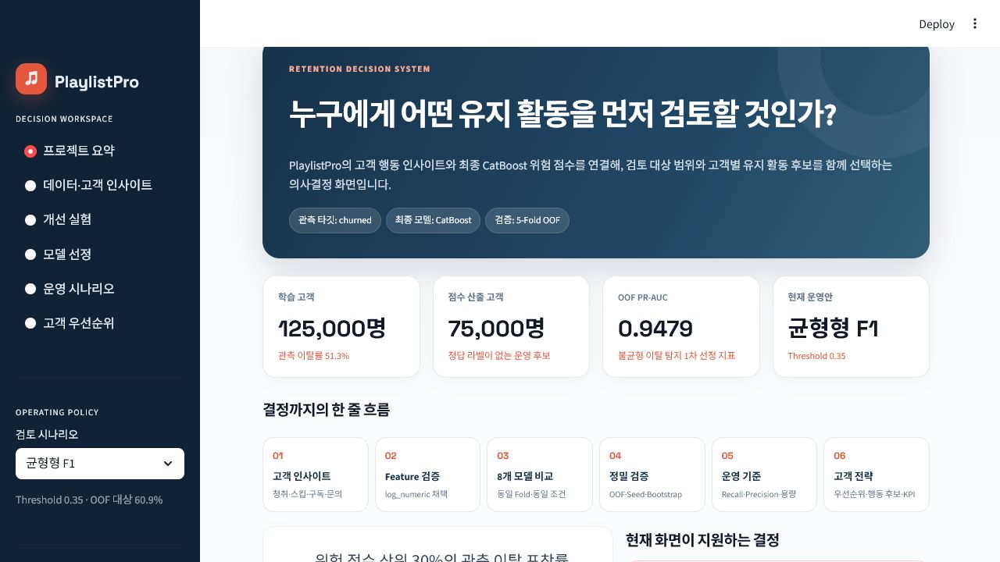
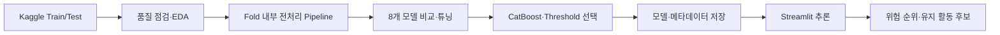
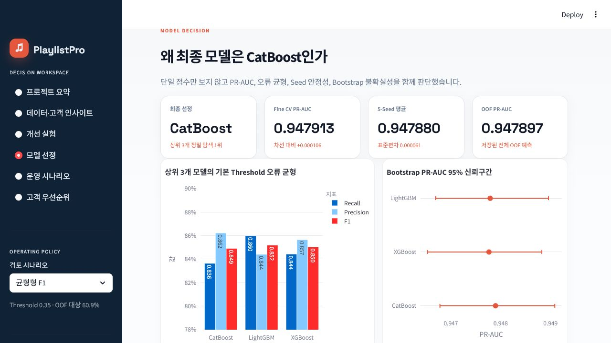
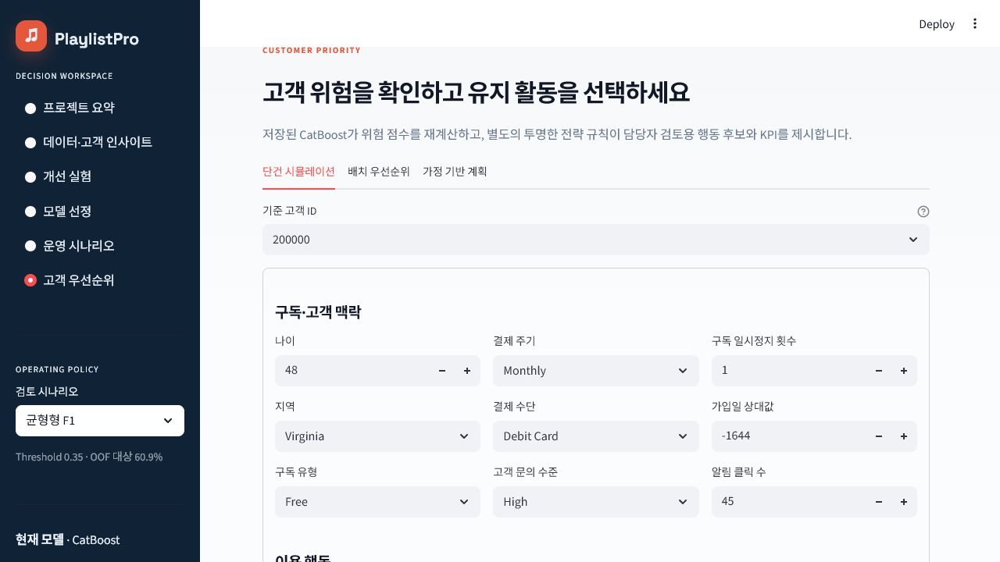
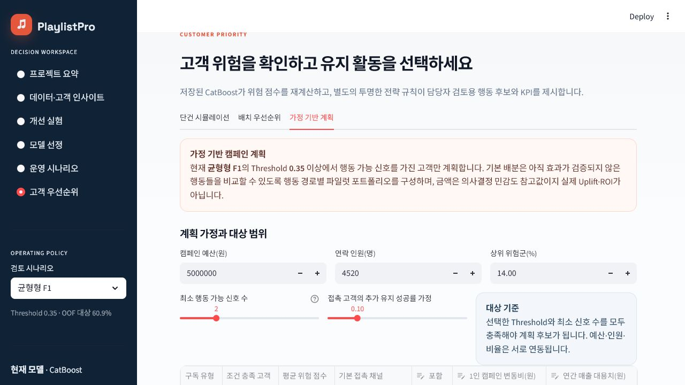

# PlaylistPro Insight

음악 스트리밍 고객의 구독·이용·문의 정보를 바탕으로 관측 이탈 위험을 예측하고, 리텐션 담당자가 **누구를 먼저 검토하고 어떤 유지 활동을 실험할지** 결정하도록 돕는 머신러닝 의사결정 지원 프로젝트입니다.

> 최종 기술 모델은 CatBoost입니다. 독립 외부 라벨 Holdout과 실제 캠페인 결과가 없으므로, 내부 5-Fold OOF 성능을 미래 일반화 성능이나 캠페인 효과로 표현하지 않습니다.



## 목차

1. [팀 소개](#1-팀-소개)
2. [프로젝트 개요](#2-프로젝트-개요)
3. [요구사항](#3-요구사항)
4. [데이터](#4-데이터)
5. [데이터 분석 및 전처리](#5-데이터-분석-및-전처리)
6. [모델링](#6-모델링)
7. [주요 기능](#7-주요-기능)
8. [프로젝트 구조](#8-프로젝트-구조)
9. [기술 스택](#9-기술-스택)
10. [설치 및 실행](#10-설치-및-실행)
11. [수행 화면과 제출 문서](#11-수행-화면과-제출-문서)
12. [한계 및 개선 방향](#12-한계-및-개선-방향)
13. [회고와 제출 전 확인](#13-회고와-제출-전-확인)

## 1. 팀 소개

### 팀명

SKN 33기 2차 프로젝트 3팀

### 프로젝트 기간

2026-07-13 ~ 2026-07-22

### 팀원 및 역할 분담

| 팀원 | GitHub | 주역할 | 담당 산출물 | 교차검토 |
|---|---|---|---|---|
| 최경돈 | [dony6366](https://github.com/dony6366) | 데이터 분석·전처리 | 데이터 품질·분포 점검, Feature Engineering, 데이터 점검·EDA Notebook, Data Card, 전처리 결과서·시각화 | 모델링 과정의 데이터 누수 여부와 발표자료의 데이터 수치 검토 |
| 김일환 | [KangDohwa](https://github.com/KangDohwa) | 모델링·성능 검증 | 8개 모델 비교, CatBoost 튜닝, OOF·Seed·Bootstrap 검증, Threshold 분석, 최종 모델·학습 결과서 | Feature 재현성과 Streamlit 추론 결과 검토 |
| 이준희B | [Isnthee](https://github.com/Isnthee) | Streamlit·서비스 구현 | 저장 CatBoost 연동, 단건·배치 예측, 고객 우선순위·운영 시나리오, 앱 테스트·시연 화면 | 모델·메타데이터 연결과 실행 안내 검토 |
| 이준희A | [june229](https://github.com/june229) | 프로젝트 통합·문서·발표·QA | README, 요구사항 문서, 발표자료·발표자 노트, 제출 체크리스트·Manifest, 링크·경로·실행 검증 | 분석 수치·결론 표현과 앱 시연 흐름 검토 |

각 담당자는 주 산출물을 작성하고, 교차검토 담당자는 수치·경로·재현성·표현의 일관성을 확인합니다. 최종 모델 선정과 발표 결론은 전원이 공동 검토했습니다. 세부 확인 항목은 [docs/human_confirmation_required.md](docs/human_confirmation_required.md)에 정리했습니다.

### 프로젝트 일정

| 단계 | 기준 일자 | 주요 작업 | 담당자 | 산출물 |
|---|---|---|---|---|
| 요구사항·데이터 감사 | 2026-07-21 | Target, 출처, 품질·합성 여부 점검 | 최경돈·이준희A | Data Card, 요구사항 정의서 |
| EDA·전처리 | 2026-07-21 | 신호·노이즈, 데이터 계약 위반, Feature 실험 | 최경돈 | 전처리 결과서, Notebook |
| 모델링·검증 | 2026-07-21~22 | 8개 모델 비교, 탐색, 안정성·운영 분석 | 김일환 | 학습 결과서, 저장 모델 |
| 서비스·통합 | 2026-07-22 | 저장 모델 연결, Streamlit·행동 후보 | 이준희B | Streamlit 시연 화면 |
| 제출 패키지 | 2026-07-22 | 문서·PDF·발표자료·ZIP 검증 | 이준희A·전원 | 현재 폴더, 별도 발표자료 |

## 2. 프로젝트 개요

### 프로젝트 정보

| 항목 | 내용 |
|---|---|
| 프로젝트명 | PlaylistPro Insight |
| 수행 기간 | 2026-07-13 ~ 2026-07-22 |
| 주제 | 음악 스트리밍 고객 이탈 예측과 리텐션 의사결정 지원 |

### 프로젝트 배경 및 필요성

구독형 음악 서비스는 한정된 상담·프로모션 자원을 모든 고객에게 동일하게 사용할 수 없습니다. 따라서 관측된 고객 프로필로 이탈 위험을 순위화하고, 운영 용량과 FN·FP 비용에 맞는 Threshold를 선택할 수 있는 근거가 필요합니다. 이 프로젝트는 예측 확률을 자동 조치가 아니라 담당자의 검토 우선순위와 실험 후보를 정하는 보조 정보로 사용합니다.

### 프로젝트 목표

1. **데이터 관점**: 데이터 품질과 출처를 점검하고, 이탈과 연관된 신호와 노이즈를 구분합니다.
2. **모델 관점**: 동일한 5-Fold 조건에서 8개 모델을 비교하고, PR-AUC와 안정성 근거로 최종 모델을 선택합니다.
3. **서비스 관점**: 저장된 모델을 Streamlit에서 불러와 위험 순위, 운영 시나리오, 유지 활동 후보를 제공합니다.

### 문제 정의

> 음악 스트리밍 서비스의 **리텐션·CRM 담당자**가 고객 관리 우선순위와 유지 활동 후보를 결정할 수 있도록, 고객별 구독·이용·문의 프로필로 제공된 `churned` 라벨을 예측합니다.

| 항목 | 정의 |
|---|---|
| 사용자 | 리텐션·CRM 담당자 |
| 예측 단위 | 고객 1명 = 1행 |
| Target | `churned`: 0=유지, 1=이탈 |
| 예측 시점 | 데이터에 기준일·결과 기간이 없어 미정의 |
| 1차 모델 지표 | PR-AUC |
| 운영 중요 지표 | Recall, Precision, F1, FN, FP, 대상 고객 수 |
| 중요 오류 | FN은 이탈 고객을 놓치고, FP는 불필요한 접촉 비용을 발생시킴 |
| 활용 | 위험 고객 순위화, 운영 Threshold 비교, 담당자 검토용 유지 활동 후보 |

### 최종 상태

| 항목 | 결과 |
|---|---:|
| 학습 고객 | 125,000명 |
| 무라벨 점수 산출 고객 | 75,000명 |
| 최종 기술 모델 | CatBoost |
| 공통 Feature | `log_numeric` |
| 평가 | 고정 Stratified 5-Fold OOF |
| Fine-tuned CV PR-AUC | 0.947913 |
| OOF PR-AUC / ROC-AUC | 0.947897 / 0.941959 |
| 5-Seed 평균 PR-AUC | 0.947880 |
| 기본 화면 Threshold | 0.35(균형형 F1, 사업 확정값 아님) |

## 3. 요구사항

| ID | 기능 | 설명 | 구현 위치 | 상태 |
|---|---|---|---|---|
| FR-01 | 고객·이탈 현황과 EDA | Target 분포와 주요 세그먼트의 관측 이탈률을 시각화 | Streamlit `데이터·고객 인사이트` | 완료 |
| FR-02 | 모델 성능 비교·선정 근거 | 동일 Fold의 모델 성능과 최종 선정 근거 제공 | `개선 실험`, `모델 선정` | 완료 |
| FR-03 | 저장 모델 기반 개별 예측 | 고객 입력값으로 이탈 확률과 위험 수준 산출 | `고객 우선순위 > 단건 시뮬레이션` | 완료 |
| FR-04 | 위험 등급·Threshold | 운영 목적에 따라 Threshold와 FN·FP 비교 | `운영 시나리오`, `고객 우선순위` | 완료 |
| FR-05 | 위험 요인·유지 활동 후보 | 행동 가능 신호를 바탕으로 담당자 검토용 후보 제시 | `고객 우선순위` | 완료 |
| FR-06 | 배치 우선순위·CSV | 여러 고객의 위험 점수와 우선순위를 CSV로 제공 | `고객 우선순위 > 배치 우선순위` | 선택 기능 완료 |
| FR-07 | 가정 기반 계획 | 접촉 용량과 성공률 가정에 따른 캠페인 규모 비교 | `고객 우선순위 > 가정 기반 계획` | 선택 기능 완료 |
| FR-08 | DL·개별 SHAP | 현재 데이터와 제출 범위에서 효용이 낮아 제외 | - | 의도적 제외 |

상세 완료 기준과 범위는 [docs/requirements.md](docs/requirements.md), 구조 차이는 [docs/project_structure_audit.md](docs/project_structure_audit.md)에서 확인합니다.

## 4. 데이터

| 항목 | 내용 |
|---|---|
| 데이터셋 | Streaming Subscription Churn Model |
| 공식 페이지 | [Kaggle Competition](https://www.kaggle.com/competitions/streaming-subscription-churn-model/data) |
| 취득 방법 | Kaggle 대회 페이지에서 Late Submission을 제출한 뒤 다운로드 |
| 취득 시점 | 프로젝트 기간(2026-07-13~22) 중 취득, 정확한 다운로드 시각은 별도 확인 필요 |
| Train | 125,000행 × 20열 |
| Test | 75,000행 × 19열, 정답 라벨 없음 |
| 키 | `customer_id`, Train/Test 교집합 0건 |
| 관측 Target 비율 | 64,174 / 125,000 = 51.34% |
| 이용 조건 | Late Submission을 통한 다운로드와 재배포 허가는 별개이며, Competition Rules 동의 및 최종 제출 범위 확인 필요 |
| 실제·합성 | 공식 표기는 확인되지 않았으나 분포·문턱값·계수 복원 결과 규칙 기반 합성으로 판정 |

파일 출처·SHA-256·공식 설명과 실제 값의 불일치는 [docs/data_source.md](docs/data_source.md)와 [docs/data_card.md](docs/data_card.md)에 기록했습니다.

### Target 분포

| Target | 의미 | 건수 | 비율 |
|---:|---|---:|---:|
| 0 | 유지 | 60,826 | 48.66% |
| 1 | 이탈 | 64,174 | 51.34% |

두 클래스의 비율이 유사하므로 별도 오버샘플링이나 class weight를 적용하지 않았습니다.

### 주요 컬럼

| 컬럼 | 자료형 | 설명 | 학습 사용 |
|---|---|---|---|
| `customer_id` | int64 | 고객 식별자 | 제외 |
| `subscription_type` | string | Free, Student, Family, Premium 요금제 | 사용 |
| `customer_service_inquiries` | string | 고객센터 문의 빈도 등급 | 사용 |
| `weekly_hours` | float64 | 주간 청취시간 | 사용 |
| `song_skip_rate` | float64 | 곡 스킵 비율 | 사용 |
| `num_subscription_pauses` | int64 | 구독 일시정지 횟수 | 사용 |
| `age` | int64 | 고객 나이 | 사용, 공정성 검토 필요 |
| `churned` | int64 | 0=유지, 1=이탈 | Target |

전체 20개 컬럼의 정의·범위·모델 사용 여부는 [데이터 사전](docs/data_dictionary.md)에 있습니다.

## 5. 데이터 분석 및 전처리

### 품질 점검

| 점검 | 결과 | 처리·근거 |
|---|---:|---|
| 결측 | 0 | 새 입력 대비 Pipeline 대치는 유지 |
| 완전 중복 | 0 | 삭제 없음 |
| 고객 ID 중복 | 0 | 식별자는 모델에서 제외 |
| 자료형·범위 | Train/Test 공통 19개 입력 컬럼 일치 | 범주형·수치형을 Pipeline에서 분리 처리 |
| 클래스 불균형 | 유지 48.66%, 이탈 51.34% | 별도 Resampling·class weight 미적용 |
| 데이터 누수 | Train/Test `customer_id` 교집합 0건 | 식별자와 Target을 Feature에서 제외 |
| `weekly_unique_songs > weekly_songs_played` | 36,996건(29.6%) | 수집 규칙 경고, 원본 임의 수정 금지 |
| `num_shared_playlists > num_playlists_created` | 30,778건(24.6%) | 수집 규칙 경고, 원본 임의 수정 금지 |

### 핵심 EDA

| 관찰 | 근거 | 활용 | 단정할 수 없는 내용 |
|---|---|---|---|
| 주간 청취시간이 낮을수록 관측 이탈률이 높음 | ≤5시간 89.1%, 40시간 초과 27.3% | 저활동 고객 진단 세그먼트 | 청취시간 증가가 이탈을 예방한다는 인과 |
| Free 요금제와 문의 High 집단의 이탈률이 높음 | Free×High 96.4%, Family×Low 12.3% | 요금제·문의 조합별 실험 후보 | 할인·상담이 실제 이탈을 줄인다는 효과 |
| 7개 신호와 11개 노이즈가 분리됨 | 이탈률 스프레드 0.10 기준 중간지대 없음 | 축소 Feature 실험과 설명력 점검 | 다른 실서비스에서도 같은 Feature가 무관하다는 결론 |
| 나이는 U자형 예측 신호를 보임 | 18~24세 62.1%, 35~60세 40.6%, 61~79세 62.3% | 모델 점수의 세그먼트 오류 점검 | 나이를 행동 배정 규칙으로 직접 사용 |

Feature 중요도는 모델이 예측에 사용한 정도이며 원인이나 개입 효과가 아닙니다. 나이·지역은 직접적인 유지 활동 배정 조건에서 제외하지만, 모델 입력을 통해 예측 점수에 간접 영향을 줄 수 있으므로 공정성 검토가 필요합니다.

### 데이터 분할과 평가

| 항목 | 적용 |
|---|---|
| 모델 비교 | 고정 Stratified 5-Fold |
| 전처리 Fit | 각 학습 Fold 내부에서만 수행 |
| 모델 선택 근거 | 5-Fold CV·OOF PR-AUC, Seed 안정성, Bootstrap 구간 |
| Test 데이터 | `churned`가 없는 75,000행으로 최종 점수 산출에만 사용 |
| 외부 Holdout | 없음 — 미래 일반화 성능을 확정할 수 없음 |

라벨이 없는 Test 데이터는 최종 성능 평가에 사용하지 않았습니다.

### 전처리 및 Feature 선택

1. `customer_id`를 모델 Feature에서 제외합니다.
2. 음수 정수 `signup_date`를 `signup_days_ago`로 변환합니다.
3. 분모 0을 고려한 비율 Feature와 `log1p` 수치 Feature를 생성합니다.
4. 수치형은 median, 범주형은 최빈값 대치 후 One-Hot 인코딩합니다.
5. 모든 변환을 학습 Fold 안에서만 Fit합니다.
6. 최종 변환 Feature는 55개입니다.

원본 모델 입력은 Target과 식별자를 제외한 19개 컬럼이며, 파생 Feature와 One-Hot 인코딩을 거쳐 55개로 변환됩니다. Logistic Regression으로 공통 Feature variant를 비교한 결과 `log_numeric`의 PR-AUC가 0.906293으로 raw 0.899495보다 0.006798 높아 모든 모델의 공통 입력으로 채택했습니다.

실행 결과가 저장된 분석 파일은 [01_data_check.ipynb](notebooks/01_data_check.ipynb)와 [02_eda.ipynb](notebooks/02_eda.ipynb), 전체 문서는 [전처리 결과서](reports/preprocessing_report.md)입니다.

## 6. 모델링

### 실험 환경

| 항목 | 설정 |
|---|---|
| Python | 3.13 |
| 평가 방식 | 고정 Stratified 5-Fold CV·OOF |
| 1차 선정 지표 | PR-AUC |
| 보조 지표 | ROC-AUC, F1, Recall, Precision, Brier |
| 공통 Feature | `log_numeric` |
| Threshold | OOF 예측에서 운영 목적별로 선택 |

### 전체 모델 비교

`Dummy → Logistic → Decision Tree → Random Forest → Gradient Boosting → XGBoost → LightGBM → CatBoost`를 동일 `log_numeric` Feature와 동일 5-Fold로 비교했습니다. Dummy를 제외한 7개 모델은 제한된 RandomizedSearch를 수행했고, 실제 상위 3개는 각각 15회 Fine Tuning을 수행했습니다.

| 모델 | OOF PR-AUC | ROC-AUC | F1@0.5 | Recall@0.5 | Precision@0.5 |
|---|---:|---:|---:|---:|---:|
| CatBoost | **0.947622** | **0.941700** | 0.847008 | 0.824181 | **0.871136** |
| LightGBM | 0.947534 | 0.941629 | **0.852983** | **0.867345** | 0.839090 |
| XGBoost | 0.947052 | 0.941105 | 0.850891 | 0.845249 | 0.856608 |
| Gradient Boosting | 0.946362 | 0.940415 | 0.851252 | 0.852432 | 0.850075 |
| Random Forest | 0.939448 | 0.934125 | 0.850400 | 0.853461 | 0.847361 |
| Decision Tree | 0.936079 | 0.933386 | 0.846347 | 0.851794 | 0.840969 |
| Logistic Regression | 0.906293 | 0.897232 | 0.811807 | 0.809954 | 0.813669 |
| Dummy | 0.513386 | 0.499987 | 0.678465 | 1.000000 | 0.513392 |

### 성능 개선 실험

| 단계 | 변경 내용 | OOF PR-AUC | 판단 |
|---|---|---:|---|
| Raw Logistic | 원본 Feature 기준선 | 0.899495 | 기준선 |
| Feature 실험 | `log_numeric` 추가 | 0.906293 | +0.006798, 공통 Feature로 채택 |
| CatBoost 기본 비교 | 동일 Feature·Fold 모델 비교 | 0.947622 | 상위 후보 |
| 제한된 RandomizedSearch | CatBoost 24개 유효 Trial | 0.948004 | 상위 3개 Fine Tuning 진입 |
| Fine Tuning | CatBoost 15개 Trial | 0.947897 | 최종 후보로 고정 |

비율 Feature와 signal-pruned Feature는 raw 대비 개선이 없거나 미미해 공통 Feature로 채택하지 않았습니다. RandomizedSearch와 Fine Tuning의 차이도 매우 작아 추가 탐색의 효과를 과장하지 않습니다.

### 상위 3개 Fine Tuning

| 모델 | Fine CV PR-AUC | OOF PR-AUC | OOF F1 | OOF Recall | OOF Precision |
|---|---:|---:|---:|---:|---:|
| **CatBoost** | **0.947913** | **0.947897** | 0.849118 | 0.836382 | 0.862247 |
| LightGBM | 0.947806 | 0.947790 | **0.851892** | **0.859850** | 0.844079 |
| XGBoost | 0.947793 | 0.947765 | 0.850378 | 0.844283 | 0.856562 |

CatBoost는 사전에 정한 Fine CV PR-AUC와 Seed 평균에서 근소하게 1위여서 선택했습니다. 상위 3개의 Bootstrap 구간이 겹치므로 압도적 우위로 표현하지 않습니다. 기본 Threshold에서 Recall·F1을 더 중시하면 LightGBM도 합리적인 대안입니다.

### 최종 모델

| 항목 | 내용 |
|---|---|
| 최종 모델 | CatBoost |
| Run ID | `20260721_full_fair_v1` |
| 선정 기준 | Fine CV PR-AUC 우선, Seed 평균·Bootstrap·보조 지표 함께 검토 |
| 평가 범위 | 고정 Stratified 5-Fold OOF |
| 기본 화면 Threshold | 0.35, 균형형 F1 시나리오 |
| 원본 입력 Feature | 19개 |
| 변환 후 Feature | 55개 |
| 운영 모델 | `artifacts/model/music_churn_pipeline.joblib` |
| 제출용 alias | `models/churn_pipeline.joblib` |
| SHA-256 | `fc35ca91e9242dbc0e914db9f0dfc9e994024a5d4cc8d0d770d12321989a7d0e` |

### 운영 시나리오

| 시나리오 | Threshold | 대상 | Recall | Precision | F1 | FN | FP |
|---|---:|---:|---:|---:|---:|---:|---:|
| 재현율 우선 | 0.29 | 77,700명 | 95.18% | 78.61% | 0.8611 | 3,091 | 16,617 |
| 균형형 F1 | 0.35 | 76,143명 | 94.44% | 79.59% | 0.8638 | 3,569 | 15,538 |
| 정밀도 우선 | 0.74 | 48,463명 | 71.80% | 95.07% | 0.8181 | 18,099 | 2,388 |

기본 화면의 0.35 시나리오는 OOF 기준으로 이탈 고객 3,569명을 놓치고(FN), 유지 고객 15,538명을 접촉 대상으로 포함합니다(FP). FN을 더 줄이려면 0.29를, 불필요한 접촉을 더 줄이려면 0.74를 검토해야 하며, 최종 사업 Threshold는 접촉 용량과 비용을 반영해 담당자가 결정합니다.

자세한 과정은 [03_model_experiments.ipynb](notebooks/03_model_experiments.ipynb), [모델 학습 결과서](reports/training_report.md), [artifacts/metrics.csv](artifacts/metrics.csv)에 있습니다.

## 7. 주요 기능

### 1. 프로젝트 요약

- 프로젝트·데이터·모델 핵심 결과와 검증 범위 요약
- Train/Test 규모, Target 분포, 최종 CatBoost와 기본 Threshold 표시

### 2. 데이터·고객 인사이트

- 신호와 노이즈, Feature 중요도, 세그먼트별 관측 이탈률 제공
- 연관성을 원인이나 개입 효과로 해석하지 않도록 한계 함께 표시

### 3. 개선 실험·모델 선정

- 전처리·Feature 개선 실험과 채택·제외 근거 제공
- 8개 모델, 상위 3개, Seed 안정성, Bootstrap 구간 비교
- Threshold, Top-K Capture, Lift, Risk Decile을 운영 관점에서 해석

### 4. 고객 우선순위·캠페인 계획

- 저장 CatBoost를 이용한 고객 단건 재추론
- 행동 가능 신호 기반 담당자 검토용 유지 활동 후보
- 배치 우선순위 CSV와 접촉 용량·성공률 가정 기반 캠페인 계획

유지 활동은 자동 실행되지 않습니다. CRM 발송, 할인 제공, 고객 접촉 및 실제 효과 검증은 이 프로젝트 범위 밖입니다.

## 8. 프로젝트 구조

```text
Team3-2nd-Project/
├── README.md
├── requirements.txt
├── app/streamlit_app.py
├── data/{train.csv,test.csv}
├── notebooks/{01_data_check,02_eda,03_model_experiments}.ipynb
├── src/                         # 전처리·추론·유지 전략 코드
├── scripts/                     # 최종 CatBoost 비교·검증·승격 코드
├── models/churn_pipeline.joblib # 제출용 최종 모델 alias
├── artifacts/                   # 운영 모델·metadata·metrics·실험 CSV
├── figures/                     # EDA·모델링·발표 시각화
├── reports/                     # Markdown 및 PDF 결과서
├── assets/screenshots/          # Streamlit 시연 근거
├── docs/                        # 데이터·요구사항·구조·제출 문서
├── tests/
├── tools/
└── submission_manifest.json
```

`src/legacy/run_holdout_pipeline.py`는 초기 Holdout·Gradient Boosting 실험을 보존한 레거시 코드입니다. 최종 CatBoost 학습 계보는 `scripts/run_full_fair_comparison.py` → `scripts/build_full_oof_diagnostics.py` → `scripts/finalize_full_fair_candidate.py` → `scripts/promote_full_fair_candidate.py`이며, 이후 `scripts/build_presentation_v3.py`와 `tools/render_reports.py`로 그림·PDF를 동기화합니다.

### 시스템 흐름



라벨 없는 Test 데이터는 `E`의 모델 선택에 사용하지 않고, 선택이 끝난 모델의 점수 산출에만 사용합니다.

## 9. 기술 스택

| 구분 | 기술 | 사용 목적 |
|---|---|---|
| Language | Python 3.13 | 데이터 분석, 모델링, 서비스 구현 |
| Data | pandas 2.3.3, NumPy 2.3.4 | 데이터 로드·검증·Feature 처리 |
| ML | scikit-learn 1.9.0, CatBoost 1.2.10, LightGBM 4.7.0, XGBoost 3.3.0 | Pipeline, 모델 비교·튜닝·평가 |
| Visualization | Matplotlib 3.9.2, Plotly 6.4.0 | EDA, 성능·운영 지표 시각화 |
| Service | Streamlit 1.51.0 | 저장 모델 기반 의사결정 지원 화면 |
| Serialization | joblib 1.5.3 + SHA-256 검증 | 모델 저장·무결성 검증 |
| Collaboration | GitHub | 형상 관리, Issue, Pull Request, Actions |

## 10. 설치 및 실행

### 실행 환경

- Python 3.13
- Windows, macOS 또는 Linux

### 설치

```bash
git clone https://github.com/SKN33-2nd-3Team/Team3-2nd-Project.git
cd Team3-2nd-Project
python -m venv .venv
```

가상환경을 활성화합니다.

```powershell
# Windows PowerShell
.\.venv\Scripts\Activate.ps1
```

```bash
# macOS / Linux
source .venv/bin/activate
```

의존성을 설치하고 Streamlit을 실행합니다.

```bash
python -m pip install -r requirements.txt
streamlit run app/streamlit_app.py
```

### 데이터 준비

`data/train.csv`와 `data/test.csv`는 Kaggle 대회 페이지에서 Late Submission을 제출한 뒤 받은 파일입니다. 파일 출처와 SHA-256은 [데이터 출처 문서](docs/data_source.md)를 확인합니다. Late Submission을 통한 다운로드와 제3자 재배포 허가는 동일하지 않으므로, 외부 배포 전에는 Competition Rules를 다시 확인해야 합니다.

### 검증

검증은 다음 명령으로 실행합니다.

```bash
python -m pytest -q
python tools/validate_submission.py
python tools/validate_streamlit.py
```

앱은 모델을 다시 학습하지 않습니다. 운영 모델 `artifacts/model/music_churn_pipeline.joblib`과 `artifacts/model/metadata.json`의 SHA-256이 다르면 로드를 중단합니다. `models/churn_pipeline.joblib`은 동일 SHA-256을 가진 제출용 alias입니다.

전체 모델 비교를 새로 재현할 때는 `python scripts/run_full_fair_comparison.py --fresh-run`으로 시작합니다. OOF 배열, 비선정 후보 모델, Fold NPZ와 Fold 배정 CSV는 재생성 가능한 로컬 중간 산출물이라 Git에 저장하지 않습니다. 학습이 끝나면 diagnostics → finalize → promote → presentation figures → report PDFs 순서로 최종 모델과 집계·문서 산출물을 갱신한 뒤 Manifest를 다시 만들고 전체 검증을 실행합니다. 정확한 실행 순서는 [제출 체크리스트](docs/submission_checklist.md)를 따릅니다.

## 11. 수행 화면과 제출 문서

| 제출물 | Markdown·원본 | PDF·실행 파일 |
|---|---|---|
| 데이터 전처리 결과서 | [reports/preprocessing_report.md](reports/preprocessing_report.md) | `reports/preprocessing_report.pdf` |
| 인공지능 모델 학습 결과서 | [reports/training_report.md](reports/training_report.md) | `reports/training_report.pdf` |
| 최종 모델 | [artifacts/model_metadata.json](artifacts/model_metadata.json) | `models/churn_pipeline.joblib` |
| 분석 파일 | `notebooks/*.ipynb`, `src/*.py` | 실행 출력 포함 |
| Streamlit 시연 | `app/streamlit_app.py` | `assets/screenshots/*.png` |
| 발표자료 | `음악스트리밍사이트_고객_이탈_분석__skn33_3team.pdf` | 저장소 외 별도 제출 |
| 전체 패키지 | `submission_manifest.json` | 상위 폴더의 ZIP |

### 대표 실행 화면

| 프로젝트 요약 | 모델 선정 | 고객 우선순위 | 캠페인 계획 |
|---|---|---|---|
|  |  |  |  |

| 화면 | 확인할 내용 |
|---|---|
| 프로젝트 요약 | 데이터 규모, 최종 모델, 평가 범위와 한계 |
| 모델 선정 | 동일 Fold 모델 비교, 상위 후보와 CatBoost 선정 근거 |
| 고객 우선순위 | 단건·배치 점수, 위험 구간, 유지 활동 후보 |
| 캠페인 계획 | 접촉 용량과 성공률 가정에 따른 운영 규모 |

최종 발표자료는 GitHub 제출 Manifest와 분리하여 별도 산출물로 제출합니다.

## 12. 한계 및 개선 방향

| 현재 한계 | 영향 | 다음 검증 |
|---|---|---|
| 규칙 기반 합성 데이터 | 점수가 실제 서비스보다 과대평가될 수 있음 | 실제 고객 데이터로 재검증 |
| 예측 기준일·결과 기간 없음 | 미래 N일 이탈로 해석 불가 | 관측·결과 창 정의 |
| 독립 외부 라벨 Holdout 없음 | 외부 일반화 확인 불가 | 시간 이후 Holdout 1회 평가 |
| Feature 중요도는 연관성 | 이탈 원인·개입 효과로 단정 불가 | 도메인 검토와 통제 실험 |
| 유지 활동 효과 미검증 | Uplift·ROI 주장 불가 | 행동별 A/B 테스트 |
| 라이선스·업무 적합성 최종 승인 미완료 | 외부 배포 판단 필요 | 담당 조직·강사 최종 확인 |

## 13. 회고와 제출 전 확인

### 팀원 회고

#### 최경돈

**잘한 점**

- 모델 성능 하나에 매몰되지 않고 시드 안정성·부트스트랩 신뢰구간까지 확인해 "차이가 유의미한가"를 스스로 검증한 점
- 데이터의 한계(합성 데이터, 외부 홀드아웃 부재, 인과관계 아님)를 숨기지 않고 문서 전체에 명시한 점
- 예측을 끝이 아니라 "누구에게 어떤 행동을 검토할지"까지 이어지는 의사결정 구조로 설계한 점

**아쉬운 점**

- 데이터셋이 발표 직전까지 크게 바뀌면서(구버전 결제주기 신호 → 신버전 행동 신호) 앞서 세운 분석 결론을 다시 세워야 했던 점
- 모델 간 성능 차이가 크지 않아, 더 정교한 차별화 지점(운영 효율·해석력 등)을 미리 준비했으면 좋았을 것
- 실제 캠페인 효과(A/B 테스트)까지는 검증하지 못하고 우선순위 산출까지로 범위가 제한된 점

**배운 점**

지표 하나의 최고점을 쫓기보다, "왜 이 지표를 쓰는지"와 "어디까지 말할 수 있는지 경계를 긋는 것"이 분석의 설득력을 훨씬 높인다는 걸 체감했다.

#### 이준희B

모델 성능 지표와 피처 임포턴스가 기대에 못 미쳐 의도한 인사이트가 나오지 않자, 원본 데이터셋의 한계 탓으로 돌렸던 스스로를 돌아보게 되었습니다. 데이터의 한계를 전처리와 적절한 튜닝으로 극복해 인사이트를 끌어내려는 고민이 부족했음을 반성합니다.

#### 김일환

8개 모델 비교와 CatBoost 튜닝, OOF·Seed·Bootstrap 및 Threshold 분석을 통해 최종 모델의 성능과 안정성을 검증하는 역할을 맡았습니다. 평소에도 GitHub를 사용해 보았지만, 이번에는 협업 규칙에 맞춰 브랜치와 커밋을 관리하고 Git 설정도 직접 다뤄보면서 체계적인 협업과 재현성 관리의 중요성을 배울 수 있었습니다.

#### 이준희A

이번 프로젝트를 통해 머신러닝 학습의 전 과정을 직접 수행하며 전체적인 흐름과 핵심 개념을 구체적으로 이해할 수 있었습니다. 진행 과정에서 다양한 이슈를 마주했지만, 이를 하나씩 해결해 나가는 과정 자체가 새로운 요소를 배우고 실무적인 대응 경험을 쌓을 수 있었던 값진 시간이었습니다.

### 제출 전 확인

- [x] 모든 팀원의 GitHub 계정을 연결했습니다.
- [x] 데이터 출처와 취득 방법을 작성했습니다.
- [x] Target과 예측 시점의 한계를 명시했습니다.
- [x] 핵심 EDA마다 관찰·활용·단정할 수 없는 내용을 작성했습니다.
- [x] 동일한 Fold에서 기준 모델과 8개 모델을 비교했습니다.
- [x] 개선되지 않은 Feature 실험도 판단 근거와 함께 기록했습니다.
- [x] 최종 모델과 Threshold를 OOF 근거로 선택했습니다.
- [x] 라벨 없는 Test를 최종 성능 평가에 사용하지 않았습니다.
- [x] 저장된 모델과 Streamlit의 연결 경로를 명시했습니다.
- [x] README의 성능 수치를 집계 산출물과 대조했습니다.
- [x] 팀원 4명의 최종 회고를 반영했습니다.
- [ ] Kaggle Competition Rules에 따른 데이터 재배포 범위를 최종 확인해야 합니다.
- [ ] 완전히 새로운 환경에서 README 순서대로 실행되는지 최종 확인해야 합니다.

기술적으로 확인 가능한 상세 항목은 [docs/final_submission_checklist.md](docs/final_submission_checklist.md)에 기록했습니다. 팀원별 회고, 최종 제출 계정, 데이터 이용 승인처럼 사람이 확인해야 하는 항목은 [docs/human_confirmation_required.md](docs/human_confirmation_required.md)에 분리했습니다.

이 프로젝트의 예측과 행동 제안은 담당자의 의사결정을 보조하며, 고객에 대한 자동 조치나 실제 캠페인 효과를 보장하지 않습니다.
