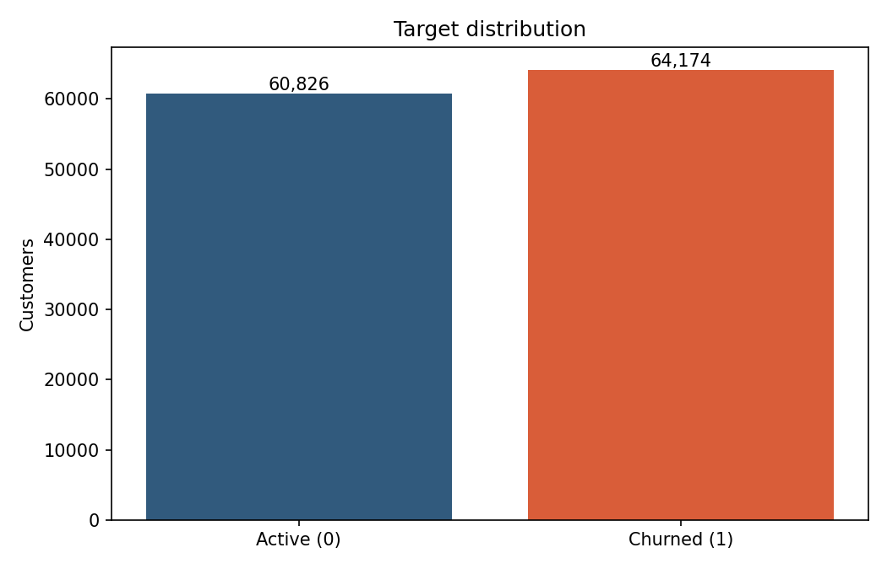
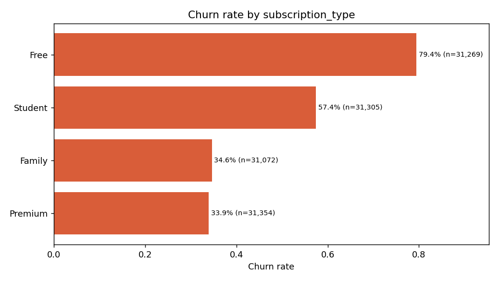
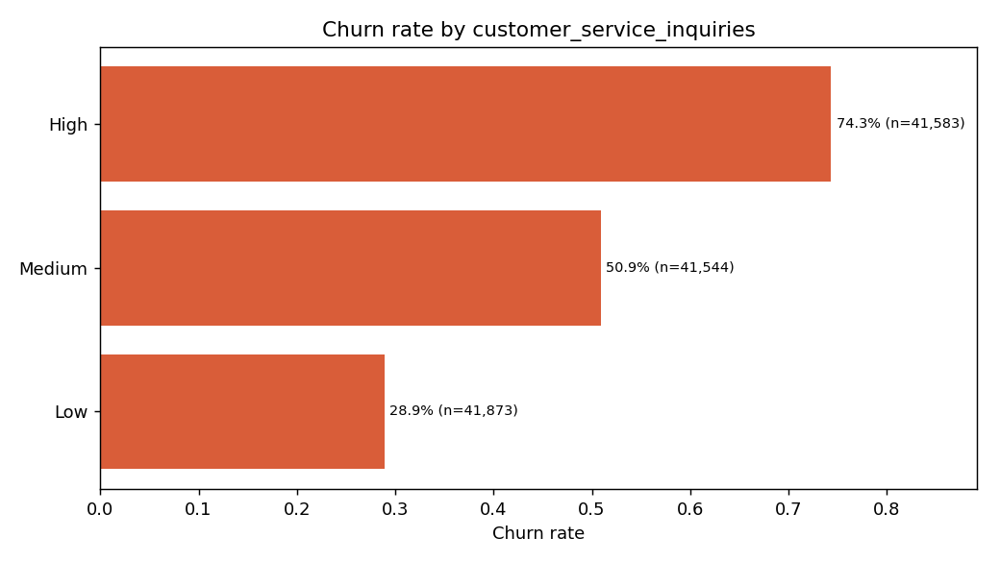
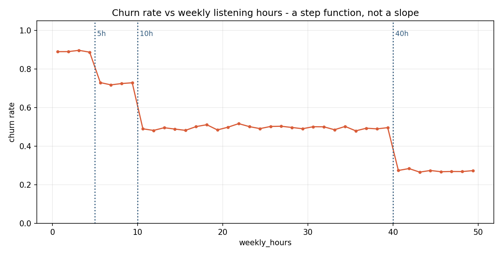
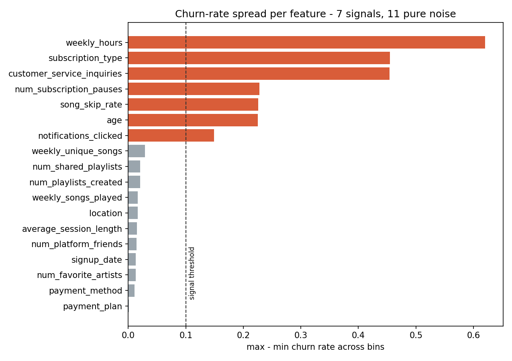
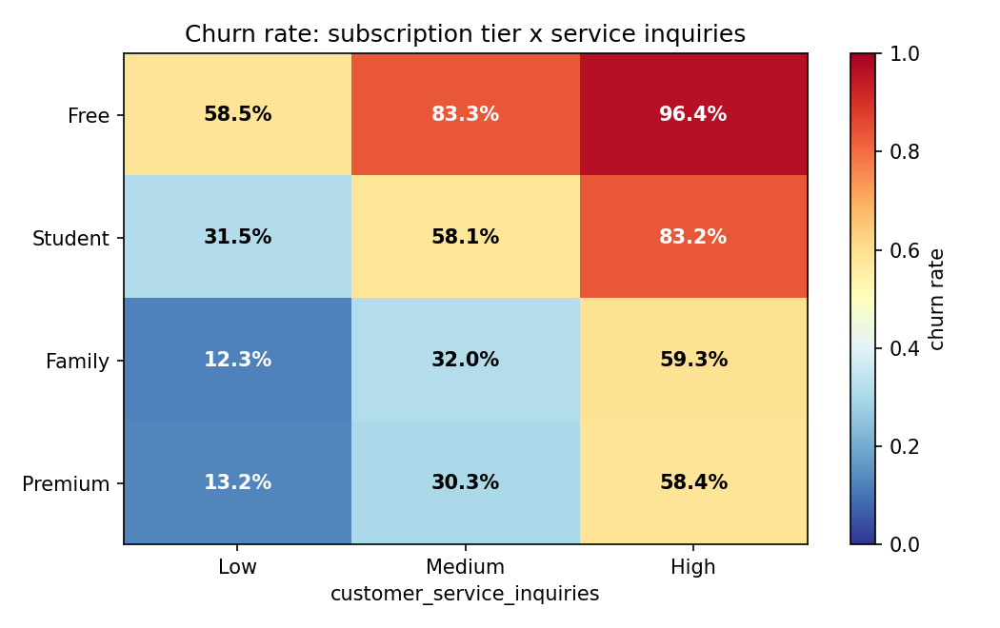
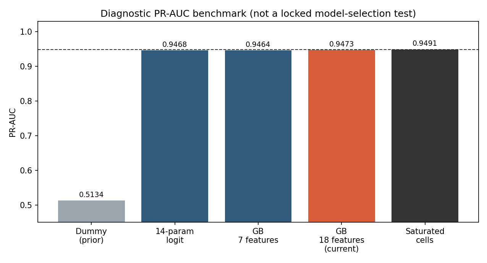

# PlaylistPro 데이터 전처리 결과서

작성일: 2026-07-22 
분석 단위: 고객 1명 = 1행 
Target: `churned`(0=유지, 1=이탈)

## 1. 분석 목적

이 문서는 원본 고객 테이블이 저장 CatBoost Pipeline의 입력으로 사용되기까지의 품질 점검, EDA, Feature 처리 및 누수 방지 근거를 설명합니다. `eda 예시.ipynb`의 순서인 **구조 이해 → 품질 진단 → 분포·관계 → 전처리 방향 → Feature Engineering → 최종 인사이트**를 적용했습니다.

관측 기준일과 결과 기간이 제공되지 않았으므로 `churned`를 “향후 30일 이탈”처럼 해석하지 않습니다. 이 프로젝트는 스냅샷 프로필로 제공된 관측 라벨을 판별하는 범위입니다.

## 2. 데이터 소개

| 항목 | 내용 |
|---|---|
| 데이터셋 | Streaming Subscription Churn Model |
| 공식 페이지 | [Kaggle Competition](https://www.kaggle.com/competitions/streaming-subscription-churn-model/data) |
| 다운로드 기록 | 2026-07-21 약 15:00 KST |
| Train | 125,000행 × 20열 |
| Test | 75,000행 × 19열, Target 없음 |
| 분석 단위 | 고객 1명 |
| 키 | `customer_id`, 각 파일에서 유일 |
| Train/Test 키 교집합 | 0건 |
| 개인정보 | 이름·연락처·이메일·정밀 위치 없음 |
| 라이선스 | 프로젝트 조사 당시 Kaggle metadata에 MIT 기록; Rules 및 최종 재배포 적법성은 제출자 확인 필요 |
| 실제·합성 | 공식 명시 확인 불가, 팀 분석으로 규칙 기반 합성 판정 |

원본 파일 SHA-256은 `docs/data_source.md`에 고정했습니다. 원본을 수정하지 않았으며 앱과 Notebook은 루트의 `data/train.csv`, `data/test.csv`를 동일하게 읽습니다.

## 3. 분석 기준과 Target

| 항목 | 정의 |
|---|---|
| Target 컬럼 | `churned` |
| 0 / 1 | 유지(active) / 이탈(churned) |
| 양성 / 음성 | 64,174명 / 60,826명 |
| 관측 이탈률 | 51.34% |
| 예측 시점·관찰 기간·결과 기간 | 미정의 |

클래스 비율이 극단적으로 치우치지 않아 SMOTE를 기본 적용하지 않았습니다. Accuracy 하나가 아니라 PR-AUC, Recall, Precision, F1 및 FN·FP를 함께 사용했습니다.

**관찰:** 유지와 이탈이 비슷한 규모입니다. 
**다음 결정:** 인위적 재표본화보다 고정 Stratified Fold와 Threshold 분석을 우선합니다. 
**한계:** 이 비율은 제공 합성 데이터의 관측 라벨 비율이며 실제 PlaylistPro 이탈률이 아닙니다.

## 4. 데이터 구조와 품질 점검

### 4.1 기본 품질

| 점검 항목 | Train | Test | 처리 |
|---|---:|---:|---|
| 결측 셀 | 0 | 0 | 새 입력 대비 Pipeline 대치는 유지 |
| 완전 중복 행 | 0 | 0 | 삭제 없음 |
| 고객 ID 중복 | 0 | 0 | 모델 Feature에서 제외 |
| Train/Test 고객 교집합 | 0 | 0 | 고객 누수 없음 |

### 4.2 공식 설명과 실제 값의 불일치

| 컬럼 | 문서 설명 | 실제 값 | 판단 |
|---|---|---|---|
| `num_subscription_pauses` | max 2 | 0~4 | 실제 값 기준 사용, 수집 계약 경고 |
| `signup_date` | 날짜 | -2,922~-1 정수 | 날짜 파싱 금지, 경과일 대용치로 처리 |
| `average_session_length` | 시간 | 1~120 | 단위 미상, 해석에서 제외 |

### 4.3 도메인 무결성 위반

| 검사 | 위반 건수 | 비율 | 처리 |
|---|---:|---:|---|
| 고유 재생곡 > 총 재생곡 | 36,996 | 29.6% | 원본 보존, 실제 적용 제한 기록 |
| 공유 플레이리스트 > 생성 플레이리스트 | 30,778 | 24.6% | 원본 보존, 실제 적용 제한 기록 |
| 수치 Feature 간 최대 절대 상관 | - | 0.007 | 독립 난수 생성 가능성 근거 |

통계적 극단값을 IQR만으로 일괄 삭제하지 않았습니다. 합성 데이터의 생성 규칙을 임의로 바꾸고 평가 분포를 왜곡할 수 있기 때문입니다.

## 5. 핵심 EDA

### 5.1 구독 유형

Free의 관측 이탈률은 79.41%, Premium은 33.91%입니다.

**관찰:** 구독 유형별 라벨 차이가 큽니다. 
**다음 결정:** 범주형 Feature를 보존하고 CatBoost·One-Hot 기반 모델을 공정 비교하며, 화면에서는 구독 옵션 안내를 행동 후보로 연결합니다. 
**한계:** 요금제 변경이 이탈을 줄인다는 인과 근거는 아닙니다.

### 5.2 고객센터 문의 수준

High의 관측 이탈률은 74.33%, Low는 28.92%입니다.

**관찰:** 문의 수준이 강한 행동 가능 신호입니다. 
**다음 결정:** 예측 Feature로 유지하고, 높은 문의 고객에게 문의 해결을 1순위 행동 후보로 제공합니다. 
**한계:** 문의 해결의 실제 유지 효과는 통제 실험이 필요합니다.

### 5.3 주간 청취시간

**관찰:** 5·10·40시간 경계에서 계단형 라벨 차이가 나타납니다. 
**다음 결정:** 단순 선형 모델뿐 아니라 비선형 Boosting 모델을 비교하고, 수치형 `log1p` 변환을 실험합니다. 
**한계:** 매끄러운 실제 사용 패턴보다 합성 생성 규칙을 반영할 가능성이 큽니다.

### 5.4 신호와 노이즈

**관찰:** 요금제·문의·청취시간·일시정지·스킵률·나이·알림 클릭은 뚜렷한 구간 차이가 있지만, 다수 소셜·재생량 변수는 거의 무작위입니다. 
**다음 결정:** 상관계수만으로 제거하지 않고 동일 Fold Feature 실험과 Tree 검증으로 채택 여부를 결정합니다. 
**한계:** Feature가 유용해 보여도 예측 시점 가용성과 수집 품질이 확보되어야 합니다.

### 5.5 구독 유형 × 문의 수준

**관찰:** 두 강한 신호가 겹친 세그먼트의 라벨 차이가 큽니다. 
**다음 결정:** 상호작용 Feature를 후보로 실험했지만, OOF PR-AUC 개선이 +0.000142로 작아 공통 Feature로 채택하지 않았습니다. 
**한계:** 세그먼트별 표본 수와 외부 재현을 확인해야 합니다.

### 5.6 합성 데이터의 이론적 상한

**관찰:** Bernoulli 난수 성분 때문에 완벽 분류가 불가능하고 현재 모델은 생성 규칙 복원에 가깝습니다. 
**다음 결정:** 소수점 성능 경쟁보다 운영 오류·안정성·한계를 함께 제시합니다. 
**한계:** 이 상한 자체도 팀이 복원한 합성 규칙에 기반한 분석입니다.

## 6. 데이터 정제와 Feature 처리

### 6.1 적용 Pipeline

| 단계 | 적용 | 근거 |
|---|---|---|
| 식별자 제거 | `customer_id` 제거 | 고객 고유 키는 일반화 Feature가 아님 |
| 날짜 대용치 | `signup_days_ago = -signup_date` | 실제 날짜가 아닌 음수 정수 |
| 비율 Feature | 곡·플레이리스트·시간 비율 | 분모에 1을 더해 0 안전 처리 |
| 로그 Feature | 6개 비음수 수치형에 `log1p` | Logistic OOF PR-AUC 개선 확인 |
| 수치·범주 결측 | median·최빈값 | 새 입력 결측 대비, Fold 내부 Fit |
| 범주 인코딩 | One-Hot, unknown 허용 | 신규 범주에서 추론 중단 방지 |
| 스케일링 | 모델별 Pipeline 내부 적용 | 선형·Tree 모델 요구 차이 반영 |
| 불균형 | SMOTE 미적용 | 51.3% 양성, 동일 Fold 확률 품질 우선 |

최종 저장 Pipeline의 변환 Feature는 55개이며 전체 목록은 `artifacts/feature_schema.json`에서 확인할 수 있습니다.

### 6.2 Feature 확장 실험

| 변형 | Logistic OOF PR-AUC | Raw 대비 | 판단 |
|---|---:|---:|---|
| Raw | 0.899495 | 기준 | 제외 |
| +1 비율 | 0.899486 | -0.000009 | 제외 |
| Zero-aware 비율 | 0.899485 | -0.000010 | 제외 |
| **Log numeric** | **0.906293** | **+0.006798** | 채택 |
| Plan × Inquiry | 0.899637 | +0.000142 | 제외 |
| Signal-pruned | 0.899493 | -0.000002 | 제외 |

Logistic은 전처리 변형을 빠르게 비교한 고정 검증기이며 최종 모델 후보가 아닙니다. CatBoost 재확인에서 `log_numeric`의 Raw 대비 PR-AUC 이점은 약 +0.000089로 작았습니다. 따라서 전체 성능 향상을 로그 변환 하나의 공으로 과장하지 않습니다.

## 7. 누수 방지와 데이터 분할

1. 고정 Stratified 5-Fold, `random_state=42`를 사용했습니다.
2. Feature Engineer·결측 대치·인코딩·스케일링은 Pipeline 안에서 학습 Fold에만 Fit했습니다.
3. Target 기반 인코딩과 전체 데이터 사전 Fit을 사용하지 않았습니다.
4. 제공 Test는 라벨이 없어 모델·Feature·파라미터·Threshold 선택에 사용하지 않았습니다.
5. 고객 ID는 Train/Test가 완전히 분리되어 있습니다.

독립 외부 라벨 Holdout은 없습니다. 따라서 OOF는 내부 비교·순위 진단 근거이며 미래 성능의 독립 검증이 아닙니다.

## 8. 전처리 전후 결과

| 구분 | 전처리 전 | Pipeline 변환 후 |
|---|---:|---:|
| 입력 행 | 125,000 | Fold별 동일 행 수 |
| 원본 입력 컬럼 | 19개(Target 제외) | 55개 변환 Feature |
| 식별자 | 포함 | 제외 |
| 범주형 | 문자열 | One-Hot |
| 날짜 대용치 | 음수 정수 | 경과일 수치 |
| 미등록 범주 | 해당 없음 | 추론 허용 |

고차원 변환 행렬은 별도 CSV로 저장하지 않았습니다. Fold 외부에서 전처리된 전체 행렬을 재사용하면 누수 가능성이 커지므로 고객 단위 입력 테이블과 저장 Pipeline을 최종 데이터 계약으로 제출합니다.

## 9. 비즈니스 인사이트와 다음 결정

| 인사이트 | 모델링 결정 | 운영 연결 |
|---|---|---|
| 청취시간이 가장 강한 수치 신호 | 비선형 모델·로그 변환 비교 | 활동 저하 고객 재활성화 후보 |
| Free·Student에서 높은 관측 이탈률 | 범주형 보존 | 구독 옵션 안내 |
| 높은 문의 수준 | 행동 가능 신호 보존 | 문의 해결 우선 |
| 일시정지·스킵률 문턱 | Tree 모델과 Threshold 분석 | 복귀·추천 피드백 후보 |
| 합성·논리 위반 | 외부 일반화 주장 제한 | KPI를 향후 실험 항목으로 명시 |

## 10. 한계

- 규칙 기반 합성 데이터로 판정되어 성능과 세그먼트 차이를 실제 서비스에 일반화할 수 없습니다.
- 관측 기준일·결과 기간이 없어 시간 기반 누수와 미래 성능을 최종 검증할 수 없습니다.
- 논리 위반이 많은 재생·플레이리스트 변수로 2차 행동 분석을 확대하면 안 됩니다.
- Feature Importance와 이탈률 차이는 인과관계가 아닙니다.
- 라이선스와 재배포 적법성은 Kaggle Rules 및 제출 조직의 최종 승인이 필요합니다.

## 11. 재현 파일

- `notebooks/01_data_check.ipynb`
- `notebooks/02_eda.ipynb`
- `src/full_fair_features.py`
- `docs/data_card.md`
- `docs/data_dictionary.md`
- `artifacts/preprocessing_experiment_results.csv`
- `figures/preprocessing/`
