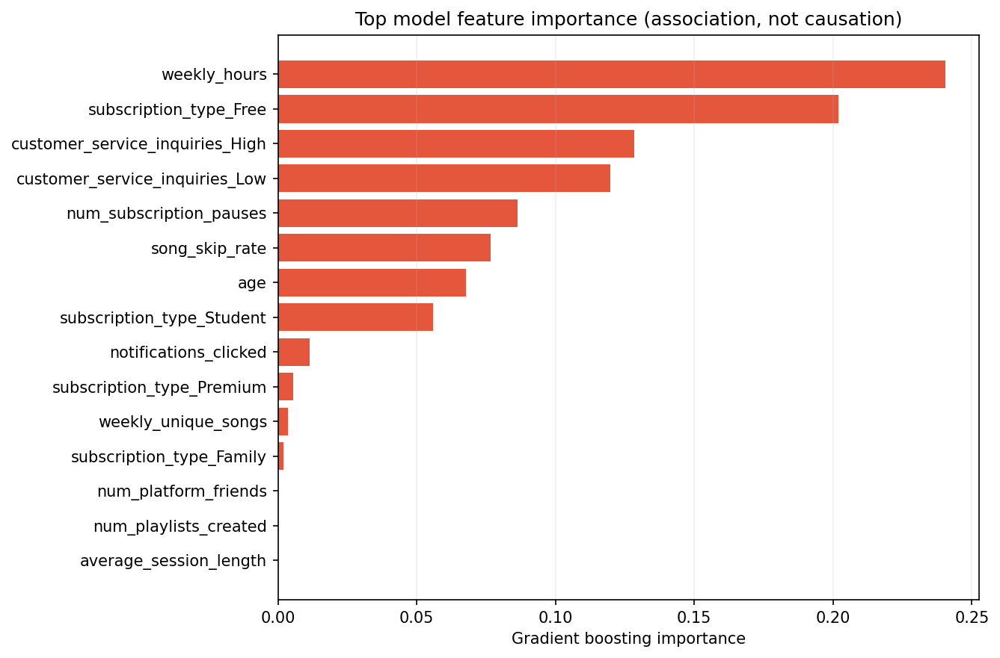

# 인공지능 모델 학습 결과서

> 작성일: 2026-07-21  
> 실행 코드: [`src/run_pipeline.py`](../src/run_pipeline.py)  
> 원시 결과: [`artifacts/model_comparison.csv`](../artifacts/model_comparison.csv)

## 1. 문제와 평가 목표

- 문제 유형: 고객 단위 이진 분류
- Target: `churned` — 0 = 유지, 1 = 이탈
- 1순위 지표: 이탈 Recall
- 2순위 지표: PR-AUC
- 보조 지표: Precision, F1, ROC-AUC, Brier, Confusion Matrix
- 비용 가정: FN:FP = 3:1
- 최종 모델: Gradient Boosting
- 운영 임계값: 0.30

FN은 떠날 고객을 놓쳐 고객가치 전체를 잃는 오류이고, FP는 남을 고객에게 불필요한 캠페인을 제공하는 오류입니다. 팀 가정상 FN 비용이 더 크므로 Recall을 우선하되, 캠페인 낭비를 통제하도록 Precision과 기대비용을 함께 평가했습니다.

## 2. 데이터 분할

| 세트 | 비율 | 행 수 | 사용 목적 |
|---|---:|---:|---|
| Train | 60% | 75,000 | 모델·전처리기 학습 |
| Validation | 20% | 25,000 | 모델 및 임계값 선택 |
| Test | 20% | 25,000 | 후보별 고정 임계값으로 모델별 1회 최종 평가 |

고객 1명 = 1행이며 반복 고객이 없으므로 `stratify=y` 층화 무작위 분할을 사용했습니다. 제공 `data/test.csv`는 라벨이 없어 모델 평가가 아니라 추론 대상으로만 사용했습니다.

## 3. 후보 모델과 학습 조건

| 모델 | 주요 설정 | 역할 |
|---|---|---|
| Dummy prior | `strategy="prior"` | 무학습 기준선 |
| Logistic Regression | `max_iter=1200`, `class_weight="balanced"` | 해석 가능한 선형 기준선 |
| Decision Tree | `max_depth=8`, `min_samples_leaf=40` | 단일 비선형 모델 |
| Random Forest | `n_estimators=160`, `max_depth=14` | 배깅 앙상블 |
| Extra Trees | `n_estimators=160`, `max_depth=16` | 무작위성 강화 앙상블 |
| Gradient Boosting | `n_estimators=150`, `learning_rate=0.05`, `max_depth=3` | 순차 오답 보완 모델 |

모든 후보는 같은 split, 같은 전처리 원칙, `random_state=42`를 사용했습니다. 하이퍼파라미터와 임계값은 Train/Validation 범위에서 결정했고, 각 후보 모델은 고정된 임계값으로 Test에서 한 번씩 평가했습니다. Test 결과를 보고 모델이나 임계값을 변경하지 않았습니다.

## 4. Validation 모델 비교

| 모델 | PR-AUC | ROC-AUC | Brier | 운영 임계값 | Recall | Precision | 기대비용/고객 |
|---|---:|---:|---:|---:|---:|---:|---:|
| **Gradient Boosting** | **0.9446** | **0.9391** | **0.1032** | **0.30** | **0.9621** | 0.7662 | **0.2090** |
| Random Forest | 0.9376 | 0.9321 | 0.1099 | 0.33 | 0.9455 | 0.7688 | 0.2299 |
| Decision Tree | 0.9259 | 0.9211 | 0.1130 | 0.23 | 0.9496 | 0.7276 | 0.2601 |
| Extra Trees | 0.9119 | 0.9063 | 0.1297 | 0.32 | 0.9469 | 0.7148 | 0.2758 |
| Logistic engineered | 0.8968 | 0.8898 | 0.1354 | 0.23 | 0.9423 | 0.6962 | 0.3000 |
| Logistic raw | 0.8968 | 0.8898 | 0.1353 | 0.23 | 0.9423 | 0.6960 | 0.3002 |
| Dummy prior | 0.5134 | 0.5000 | 0.2498 | 0.05 | 1.0000 | 0.5134 | 0.4866 |

Gradient Boosting은 가장 높은 Validation PR-AUC와 가장 낮은 기대비용을 동시에 기록해 최종 모델로 선정했습니다.

## 5. 임계값 결정

1. Validation 확률에서 0.05~0.95를 0.01 간격으로 탐색했습니다.
2. 각 임계값의 `(3 × FN + 1 × FP) / N`을 계산했습니다.
3. 기대비용 최소, 동률이면 Recall, 다시 동률이면 Precision 순으로 선택했습니다.
4. 선택한 0.30을 Test에 고정했습니다.

전체 탐색값은 [`artifacts/threshold_sweep_validation.csv`](../artifacts/threshold_sweep_validation.csv)에 있습니다.

| FN:FP 가정 | 최적 임계값 | Validation Recall | Validation Precision |
|---|---:|---:|---:|
| 1:1 | 0.52 | 83.7% | 86.2% |
| 2:1 | 0.36 | 94.4% | 78.9% |
| **3:1** | **0.30** | **96.2%** | **76.6%** |
| 5:1 | 0.28 | 96.5% | 76.0% |
| 8:1 | 0.22 | 97.6% | 71.6% |

FN:FP = 3:1은 팀 가정이며 사업부 승인값이 아닙니다. 실제 LTV·접촉 비용·방어 성공률이 확보되면 임계값을 다시 계산해야 합니다.

## 6. 최종 Test 평가

| 지표 | 결과 |
|---|---:|
| PR-AUC | 0.9473 |
| ROC-AUC | 0.9416 |
| Recall @ 0.30 | 0.9617 |
| Precision @ 0.30 | 0.7679 |
| F1 @ 0.30 | 0.8540 |
| 기대비용/고객 | 0.2082 |

### Confusion Matrix

| 실제 \ 예측 | 유지(0) | 이탈(1) |
|---|---:|---:|
| 유지(0) | TN 8,435 | FP 3,730 |
| 이탈(1) | FN 492 | TP 12,343 |

- FN 492명: 실제 이탈 고객 중 3.8%를 놓쳤습니다.
- FP 3,730명: 유지 고객에게 불필요한 캠페인을 제안할 수 있습니다.
- 임계값을 0.5보다 낮춰 FN을 줄였고, 그 대가로 FP가 늘었습니다.

## 7. 모델 해석

상위 중요도는 `weekly_hours`, Free 요금제, 상담 문의 High·Low, `num_subscription_pauses`, `song_skip_rate`, `age`, Student 요금제 순입니다.

Feature Importance는 모델의 분기 기여도이며 이탈의 원인을 증명하지 않습니다. 따라서 유지 활동은 상담 개선, 요금제 제안, 일시정지 고객 케어, 콘텐츠 추천 개선에 대한 **실험 후보**로만 제안합니다.

## 8. 최종 모델 저장과 추론 검증

| 파일 | 내용 |
|---|---|
| `artifacts/model/music_churn_pipeline.joblib` | 피처 생성·전처리·Gradient Boosting 통합 Pipeline |
| `artifacts/model/metadata.json` | 모델명, threshold, Feature 순서, 지표, 환경, 데이터 해시 |
| `artifacts/model_comparison.csv` | 후보 7종 Validation/Test 비교 |
| `artifacts/test_predictions.csv` | 제공 test 75,000명의 확률·위험 등급 |

Streamlit은 저장 Pipeline을 `joblib.load`로 불러와 신규 입력 DataFrame에 `predict_proba`를 호출합니다. 모델 재학습 없이 단일 고객과 배치 고객을 예측합니다.

## 9. 딥러닝 제외 근거

| 비교 | Test PR-AUC |
|---|---:|
| 7버킷 가법 로지스틱, 파라미터 15개 | 0.9468 |
| Gradient Boosting, 신호 7개 | 0.9464 |
| Gradient Boosting, 전체 18개 | 0.9473 |
| 포화 셀 모델 이론 상한 | 0.9491 |

단순 가법 모델과 최종 모델 차이가 0.0005이고 합성 생성 규칙의 상한에 근접했습니다. MLP나 추가 앙상블은 복잡도 대비 기대 이득이 없어 적용하지 않았습니다.

## 10. 한계와 개선 방향

1. 합성 데이터 생성 규칙을 복원한 결과이므로 실제 서비스 성능으로 해석할 수 없습니다.
2. 예측 시점과 결과 기간이 없어 시간 누수·드리프트를 검증하지 못했습니다.
3. 비용비와 LTV는 팀 가정입니다. 실제 캠페인 데이터로 재산정해야 합니다.
4. 확률 calibration은 Brier 점수만 확인했습니다. Reliability diagram과 calibration slope를 추가할 수 있습니다.
5. 실제 서비스 적용 전 시간 분할 외부 검증, A/B 테스트, 데이터 드리프트 감시가 필요합니다.
