# PlaylistPro 인공지능 모델 학습 결과서

작성일: 2026-07-22 
최종 기술 모델: CatBoost 
완료 Run: `20260721_full_fair_v1`

## 1. 문제 유형과 선정 원칙

`churned`(0=유지, 1=이탈)를 예측하는 이진 분류 문제입니다. 이탈 고객을 놓치는 FN과 불필요한 접촉을 만드는 FP를 함께 관리해야 하므로 다음 순서로 판단했습니다.

1. 모델 순위 품질: PR-AUC
2. 내부 일반화: 고정 5-Fold OOF
3. 운영 Guardrail: Recall, Precision, F1, FN, FP, 대상 고객 수
4. 안정성: 5개 Seed와 1,000회 Bootstrap
5. 확률 품질: Brier와 Calibration
6. 재현성: 저장 Pipeline 재로딩·스키마 테스트

Accuracy 단독으로 모델을 선정하지 않았고, Threshold는 모델 선택과 분리했습니다.

## 2. 데이터 분할과 비교 조건

| 항목 | 설정 |
|---|---|
| 데이터 | Train 125,000명, Test 75,000명(무라벨) |
| 비교 Fold | 고정 Stratified 5-Fold |
| Random State | 42 |
| 공통 Feature | `log_numeric` |
| 전처리 | 각 학습 Fold 내부 Pipeline Fit |
| 1차 지표 | PR-AUC |
| 외부 라벨 Holdout | 없음 |

모든 8개 모델은 저장된 동일 Fold와 동일 Feature를 사용했습니다. 제공 Test는 추론에만 사용했으며 모델·파라미터·Threshold 선택에 사용하지 않았습니다.

## 3. Baseline과 후보 모델

| 모델 | 포함 이유 |
|---|---|
| DummyClassifier | 학습 모델이 넘어야 할 양성 비율 기준선 |
| Logistic Regression | 해석 가능한 선형 기준선과 전처리 검증기 |
| Decision Tree | 단순 비선형 규칙 기준 |
| Random Forest | Bagging 기반 상호작용 비교 |
| Gradient Boosting | 순차 Boosting 기준 |
| XGBoost | 규제·병렬 Tree Boosting 후보 |
| LightGBM | 빠른 Histogram Boosting과 높은 Recall 후보 |
| CatBoost | 범주형·비선형 관계에 강한 Boosting 후보 |

MLP·딥러닝은 일반 정형 합성 데이터에서 발표 가치 대비 비용이 낮고, 강한 Boosting 기준선이 이미 있어 의도적으로 제외했습니다.

## 4. 전처리 기반 성능 개선

Raw Logistic OOF PR-AUC 0.899495에서 `log_numeric` Logistic 0.906293으로 +0.006798 개선했습니다. 비율 Feature와 signal-pruned 변형은 개선하지 못해 제외했습니다. Tree 검증에서 `log_numeric`의 Raw 대비 차이는 +0.000089로 작으므로, 공통 Feature의 일관성을 위한 선택이지 전체 성능 향상의 유일 원인으로 주장하지 않습니다.

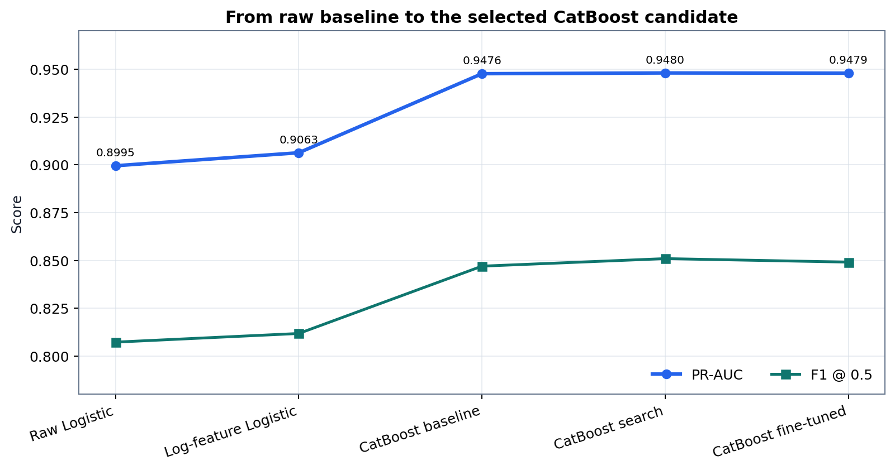

## 5. 8개 모델 동일 조건 비교

| 모델 | PR-AUC | ROC-AUC | F1 | Recall | Precision | Brier | 학습 초 |
|---|---:|---:|---:|---:|---:|---:|---:|
| CatBoost | **0.947622** | **0.941700** | 0.847008 | 0.824181 | **0.871136** | 0.095612 | 15.8 |
| LightGBM | 0.947534 | 0.941629 | **0.852983** | **0.867345** | 0.839089 | **0.095306** | 12.2 |
| XGBoost | 0.947052 | 0.941105 | 0.850891 | 0.845249 | 0.856608 | 0.101813 | 10.1 |
| Gradient Boosting | 0.946362 | 0.940415 | 0.851252 | 0.852432 | 0.850075 | 0.102189 | 344.9 |
| Random Forest | 0.939448 | 0.934125 | 0.850400 | 0.853461 | 0.847361 | 0.108169 | 26.2 |
| Decision Tree | 0.936079 | 0.933386 | 0.846347 | 0.851794 | 0.840969 | 0.102677 | 10.9 |
| Logistic | 0.906293 | 0.897232 | 0.811807 | 0.809954 | 0.813669 | 0.130653 | 3.7 |
| Dummy | 0.513386 | 0.499987 | 0.678465 | 1.000000 | 0.513392 | 0.249821 | 2.5 |

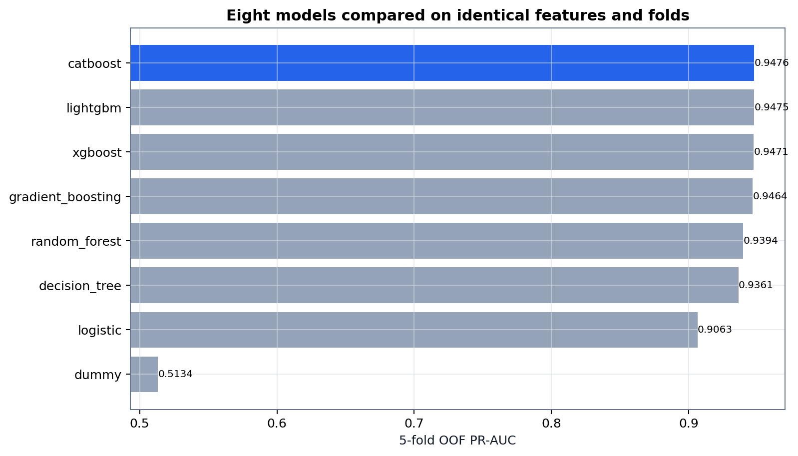

CatBoost의 PR-AUC가 가장 높고 LightGBM은 기본 Threshold에서 F1·Recall·Brier가 더 좋습니다. 이 Trade-off 때문에 단일 지표만으로 운영 정책을 확정하지 않았습니다.

## 6. 하이퍼파라미터 탐색

### 6.1 제한된 RandomizedSearch

| 모델 | Trial | 유효 Trial | 최선 CV PR-AUC |
|---|---:|---:|---:|
| Logistic | 20 | 20 | 0.906304 |
| Decision Tree | 20 | 20 | 0.935717 |
| Random Forest | 24 | 24 | 0.942988 |
| Gradient Boosting | 24 | 24 | 0.947974 |
| XGBoost | 30 | 30 | 0.947856 |
| LightGBM | 30 | 30 | 0.947743 |
| CatBoost | 24 | 24 | **0.948016** |

Random Forest와 Gradient Boosting은 사용자 요청에 따라 탐색 범위를 경량화했지만 모델을 제외하지 않았습니다. 완료된 Checkpoint를 재사용했고 제출 문서 생성 중 재학습하지 않았습니다.

### 6.2 실제 상위 3개 Fine Tuning

| 모델 | Trial | Fine CV PR-AUC | OOF PR-AUC | F1 | Recall | Precision |
|---|---:|---:|---:|---:|---:|---:|
| **CatBoost** | 15 | **0.947913** | **0.947897** | 0.849118 | 0.836382 | **0.862247** |
| LightGBM | 15 | 0.947806 | 0.947790 | **0.851892** | **0.859850** | 0.844079 |
| XGBoost | 15 | 0.947793 | 0.947765 | 0.850378 | 0.844283 | 0.856562 |

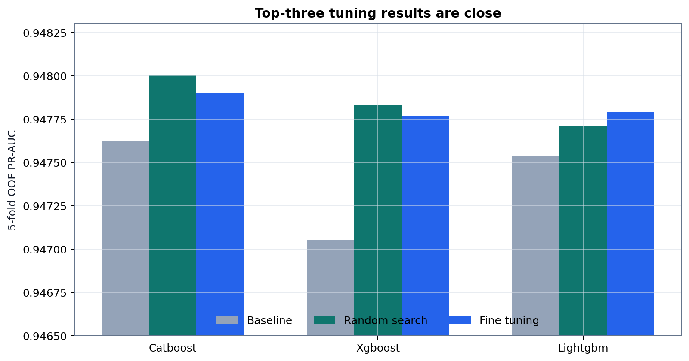

## 7. 최종 CatBoost 선정 근거

| 판단 기준 | CatBoost | XGBoost | LightGBM | 해석 |
|---|---:|---:|---:|---|
| Fine CV PR-AUC | **0.947913** | 0.947793 | 0.947806 | 사전 1차 기준 1위 |
| OOF PR-AUC | **0.947897** | 0.947765 | 0.947790 | 순위 품질 근소한 1위 |
| 5-Seed 평균 PR-AUC | **0.947880** | 0.947726 | 0.947721 | Seed 평균 1위 |
| 5-Seed 표준편차 | 0.000061 | **0.000061** | 0.000095 | 모두 안정적 |
| Brier | 0.095215 | 0.095383 | **0.095049** | LightGBM 소폭 우위 |
| 평균 Calibration gap | 0.01454 | 0.01899 | **0.01250** | LightGBM 소폭 우위 |

CatBoost를 **기술 후보**로 선택한 이유는 Fine CV·OOF·Seed 평균 PR-AUC가 일관되게 근소한 1위이기 때문입니다. 그러나 Bootstrap 95% 구간이 겹치며, LightGBM은 기본 Threshold의 Recall·F1과 확률 보정에서 소폭 우위입니다. 따라서 “CatBoost가 모든 기준에서 압도적으로 최고”라고 주장하지 않습니다.

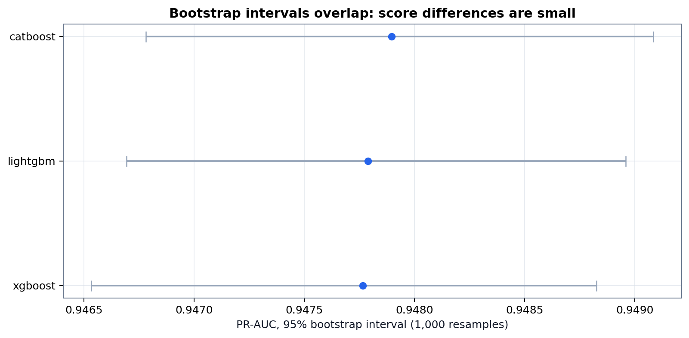

## 8. Threshold와 운영 오류

### 8.1 기본 Threshold 0.50

| PR-AUC | ROC-AUC | F1 | Recall | Precision | TP | TN | FN | FP |
|---:|---:|---:|---:|---:|---:|---:|---:|---:|
| 0.947897 | 0.941959 | 0.849118 | 0.836382 | 0.862247 | 53,674 | 52,251 | 10,500 | 8,575 |

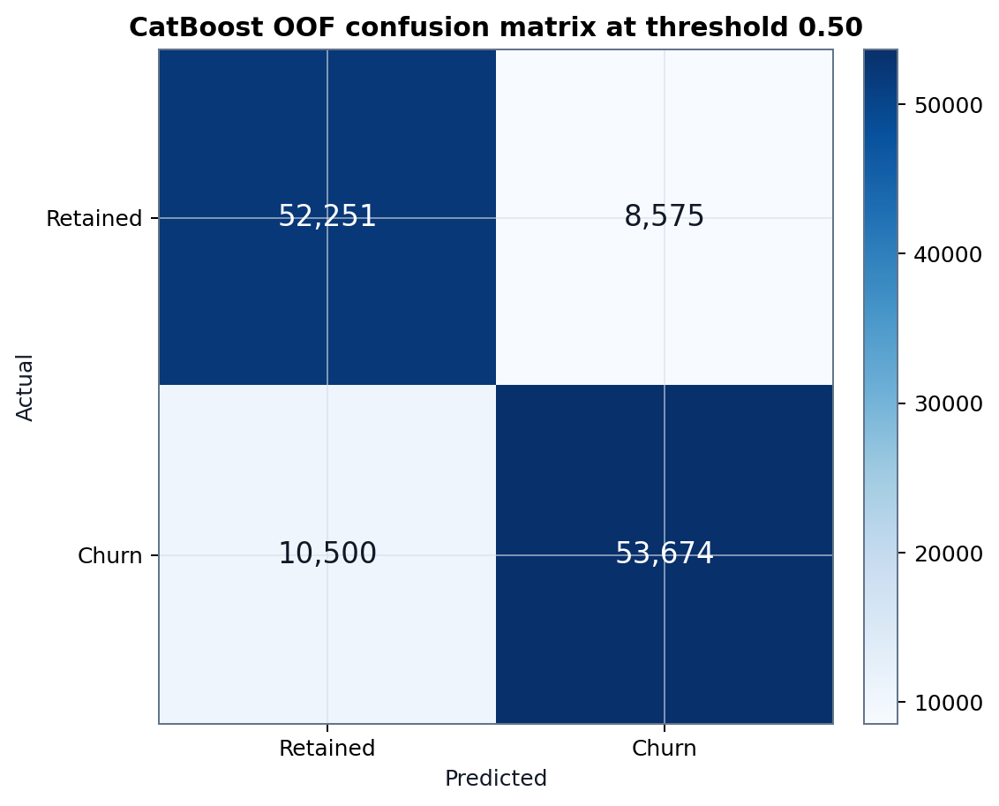

### 8.2 운영 선택지

| 시나리오 | Threshold | 대상 | Recall | Precision | F1 | FN | FP |
|---|---:|---:|---:|---:|---:|---:|---:|
| 재현율 우선 | 0.29 | 77,700 | 0.9518 | 0.7861 | 0.8611 | 3,091 | 16,617 |
| 균형형 F1 | 0.35 | 76,143 | 0.9444 | 0.7959 | **0.8638** | 3,569 | 15,538 |
| 정밀도 우선 | 0.74 | 48,463 | 0.7180 | **0.9507** | 0.8181 | 18,099 | 2,388 |

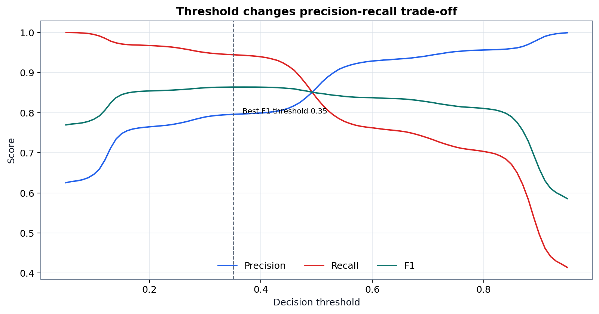

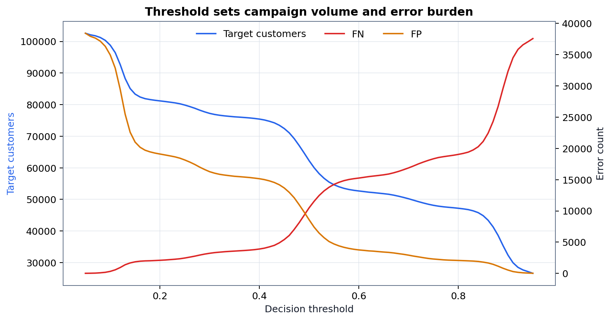

기본 화면값 0.35는 OOF F1이 높은 선택지일 뿐 사업 확정값이 아닙니다. Recall 우선 여부, 접촉 가능 인원 및 FN·FP 비용이 바뀌면 다른 Threshold나 LightGBM이 선택될 수 있습니다.

## 9. Top-K, Lift와 Risk Decile

| Top K | 대상 고객 | 포착 이탈 고객 | Capture | Precision | Lift |
|---:|---:|---:|---:|---:|---:|
| 5% | 6,250 | 6,250 | 9.74% | 100.00% | 1.948 |
| 10% | 12,500 | 12,500 | 19.48% | 100.00% | 1.948 |
| 20% | 25,000 | 24,996 | 38.95% | 99.98% | 1.948 |
| 30% | 37,500 | 36,457 | 56.81% | 97.22% | 1.894 |
| 40% | 50,000 | 47,158 | 73.48% | 94.32% | 1.837 |

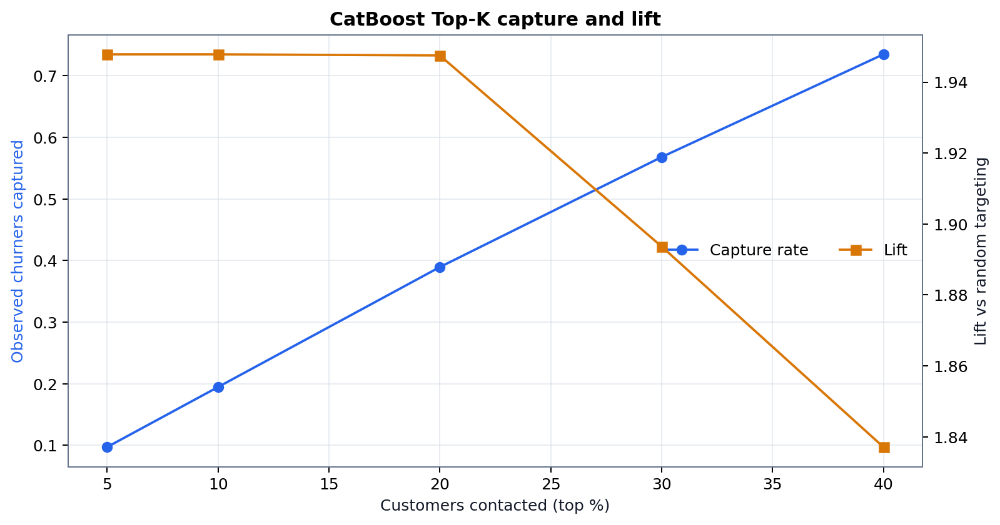

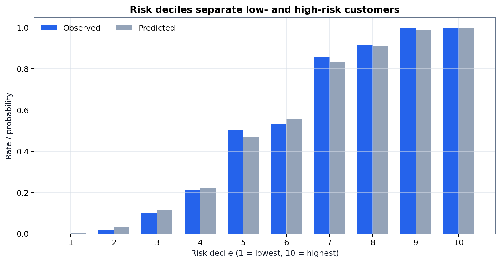

이 값은 OOF 순위 진단입니다. 캠페인 Uplift나 실제 접촉 효과가 아닙니다. 합성 규칙이 위험 순위를 강하게 분리해 Top 10% Precision 100%가 나타났으므로 실서비스 기대치로 사용하면 안 됩니다.

## 10. 오류·세그먼트 분석

| 세그먼트 | 고객 | 관측 이탈률 | PR-AUC | Recall | Precision | FN | FP |
|---|---:|---:|---:|---:|---:|---:|---:|
| Family | 31,072 | 34.58% | 0.8893 | 0.7488 | 0.7929 | 2,699 | 2,101 |
| Free | 31,269 | 79.41% | 0.9827 | 0.9271 | 0.9158 | 1,810 | 2,117 |
| Premium | 31,354 | 33.91% | 0.8793 | 0.7238 | 0.7923 | 2,937 | 2,017 |
| Student | 31,305 | 57.39% | 0.9461 | 0.8300 | 0.8644 | 3,054 | 2,340 |

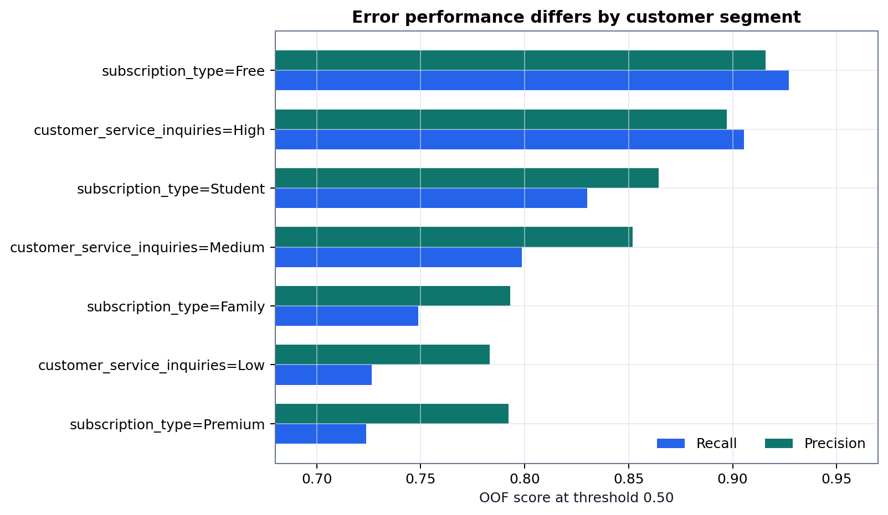

Premium·Family의 Recall이 낮아 일률적인 전체 지표만으로 운영하면 놓치는 고객군이 달라질 수 있습니다. 다만 합성 데이터의 세그먼트 차이이며 실제 공정성 평가를 대신하지 않습니다.

## 11. 모델 해석

상위 중요 Feature는 Free 요금제, 문의 수준, `log1p_weekly_hours`, 나이, 일시정지 횟수, 청취시간, 스킵률입니다.

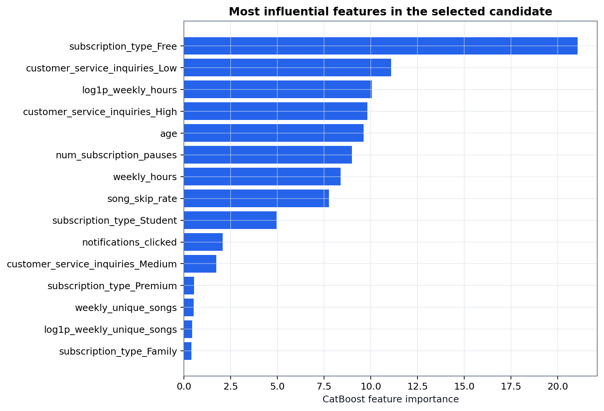

Feature Importance는 모델이 예측에 사용한 정도이며 이탈의 인과 원인이 아닙니다. 나이·지역은 행동 배정 근거에서 제외하고, 문의·청취시간·스킵·일시정지·구독 유형만 투명한 유지 전략 규칙에 사용합니다.

## 12. 저장 모델과 재현성

| 항목 | 결과 |
|---|---|
| 모델 파일 | `models/churn_pipeline.joblib` |
| SHA-256 | `fc35ca91e9242dbc0e914db9f0dfc9e994024a5d4cc8d0d770d12321989a7d0e` |
| 새 프로세스 재로딩 | 통과 |
| 신규 한 행 예측 | 통과 |
| 열 순서 변경 | 허용 |
| 미등록 범주 | 허용 |
| 필수 열 누락 | 거부 |
| 잘못된 수치 자료형 | 거부 |
| Streamlit 재학습 | 없음 |

모델과 함께 `artifacts/feature_schema.json`, `artifacts/model_metadata.json`, `artifacts/metrics.csv`를 제출합니다.

## 13. 한계와 최종 판단

- 독립된 외부 라벨 Holdout이 없어 외부 일반화를 검증하지 못했습니다.
- 예측 시점과 결과 기간이 없어 시간 기반 검증이 필요합니다.
- 규칙 기반 합성 데이터의 높은 성능은 실제 서비스 기대치가 아닙니다.
- OOF Threshold는 운영 Trade-off 참고값이며 독립 성능이 아닙니다.
- 유지 행동의 Uplift·ROI는 실제 A/B 테스트와 미래 라벨이 필요합니다.
- 실제 운영 모델 승인, Threshold 선택, 데이터 권리 및 배포는 사용자·조직의 결정입니다.

현재 증거에서 CatBoost는 PR-AUC 우선 목표에 가장 부합하는 **권고 기술 후보**입니다. Recall·FN 최소화가 절대 우선이면 LightGBM 또는 CatBoost의 더 낮은 Threshold를 함께 검토해야 합니다.

## 14. 재현 파일

- `notebooks/03_model_experiments.ipynb`
- `artifacts/model_comparison_fair.csv`
- `artifacts/random_search_summary.csv`
- `artifacts/top3_fine_tuning_summary.csv`
- `artifacts/bootstrap_confidence_intervals.csv`
- `artifacts/threshold_operating_scenarios_v2.csv`
- `artifacts/topk_lift_oof_catboost.csv`
- `artifacts/risk_decile_oof_catboost.csv`
- `artifacts/metrics.csv`
- `figures/training/`
