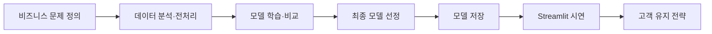

# 고객 이탈 예측 단위 프로젝트 가이드

> 발표: 2026년 7월 22일
> 
> 
> 주제: 가입 고객 이탈 예측
> 

## 1. 프로젝트 목표

고객 데이터를 분석해 **이탈 가능성이 높은 고객을 예측**하고,

해당 고객에게 어떤 유지 활동을 제공할지 제안한다.

이번 프로젝트는 단순히 정확도가 높은 모델을 만드는 것이 목적이 아니다.

> 데이터 분석 → 모델 학습 → 성능 평가 → 고객 이탈 예측 → 비즈니스 활용
> 

전체 과정이 자연스럽게 연결되어야 한다.



### 2026년 선행 프로젝트에서 확인한 핵심 교훈

| 좋은 프로젝트 | 반복해서 발견된 문제 |
| --- | --- |
| 예측 시점과 Target이 명확함 | Target을 거의 직접 알려주는 미래·사후 Feature 사용 |
| Train/Validation/Test 역할이 분리됨 | Test로 모델·early stopping·threshold를 선택 |
| 전처리와 모델을 하나의 Pipeline으로 저장 | 전체 데이터 전처리 후 split 또는 SMOTE 후 CV |
| ML 기준 모델 후 필요한 DL만 추가 | 모델 수와 서비스 기능을 과도하게 확장 |
| 저장 모델을 Streamlit에서 실제 호출 | 앱 실행 때 재학습하거나 고정 JSON 결과만 표시 |

## 2. 주제 선정

### 2.1 좋은 주제의 조건

다음 여섯 문장에 답할 수 있는 주제를 선택한다.

1. 서비스를 사용할 사람은 누구인가?
2. 그 사람이 내려야 하는 의사결정은 무엇인가?
3. 예측할 Target과 0/1의 의미는 무엇인가?
4. 언제 예측하며, 그 시점에 알 수 있는 정보는 무엇인가?
5. FN과 FP 중 어떤 오류의 비용이 더 큰가?
6. Streamlit에서 어떤 입력을 바꾸면 어떤 결과가 달라져야 하는가?

주제 정의 문장은 다음 형식을 사용한다.

> `[사용자]`가 `[의사결정]`을 할 수 있도록 `[데이터]`로 `[Target]`을 예측하고 `[행동]`을 제안한다.
> 

### 2.2 난이도별 권장 범위

| 난이도 | 데이터 유형 | 예시 | 권장 |
| --- | --- | --- | --- |
| 안전 | 타깃이 포함된 단일 CSV | 통신, 은행, 직원, 예약 이탈 | 현재 일정에 가장 적합 |
| 중간 | 고객·거래·이용 로그 다중 테이블 | OTT, 이커머스, 교육 중도이탈 | 고객 1명 단위 집계 필요 |
| 도전 | 패널·시간 데이터 | 연도별 통신사 변경, 장기 미활동 | 시간/그룹 분할 필요 |
| 고위험 | API 시계열·수천만 건 로그·텍스트 결합 | YouTube, Steam, KKBOX | 축소본이 없으면 비권장 |

주제 승인 전 데이터 다운로드, Target 생성, 화면 입력 항목을 실제로 확인한다.

## 3. 필수 산출물

모든 팀은 다음 결과물을 제출한다.

1. 데이터 전처리 결과서
2. 인공지능 모델 학습 결과서
3. 학습된 최종 모델
4. Streamlit 시연 화면
5. README와 발표자료

### 산출물 완료 기준

- 전처리 결과서: 출처, Target, 품질 점검, EDA, 전처리 근거
- 학습 결과서: 분할, 기준 모델, 비교표, 최종 Test, 한계
- 최종 모델: 새 프로세스에서 로드하고 신규 고객을 예측
- Streamlit: 저장 모델의 실제 확률과 유지 활동을 표시
- README: 설치부터 화면 실행까지 2~3개 명령으로 재현

권장 프로젝트 구조는 다음과 같다. 노트북은 탐색과 설명에 사용하고, 반복 실행과 Streamlit 연결 코드는 `src`에 둔다.

```
project/
├── README.md
├── requirements.txt
├── .gitignore
├── .env.example
├── docs/
│   ├── requirements.md        # 사용자, Target, 지표, 완료 조건
│   ├── data_dictionary.md     # 컬럼·자료형·단위·출처
│   └── validation_plan.md     # 분할·검증·임계값 결정 방법
├── data/
│   ├── raw/                   # 원본 수정 금지
│   ├── interim/               # 병합·집계 중간 데이터
│   └── processed/             # 최종 학습 테이블
├── notebooks/
│   ├── 01_data_check.ipynb
│   ├── 02_eda.ipynb
│   └── 03_model_experiments.ipynb
├── src/
│   ├── data.py                # 로드·검증·데이터셋 생성
│   ├── features.py            # Feature 생성
│   ├── train_ml.py            # ML 학습
│   ├── train_dl.py            # 선택 DL 학습
│   ├── evaluate.py            # 공통 평가
│   └── predict.py             # 앱과 공유하는 추론 함수
├── models/
│   └── churn_pipeline.joblib
├── artifacts/
│   ├── feature_schema.json
│   ├── model_metadata.json
│   └── metrics.csv
├── streamlit_app/
│   ├── app.py
│   └── pages/
│       ├── 1_현황.py
│       ├── 2_모델성능.py
│       └── 3_이탈예측.py
├── reports/
│   ├── preprocessing_report.md
│   └── training_report.md
├── tests/
│   └── test_inference.py
└── presentation.pdf
```

### 구조 운영 원칙

- `data/raw`의 원본은 수정하지 않는다.
- 개인 PC 절대경로 대신 프로젝트 루트 기준 상대경로를 사용한다.
- 모델, 전처리기, Feature 순서, threshold를 함께 저장한다.
- Streamlit은 노트북을 실행하지 않고 저장된 모델과 `src/predict.py`를 사용한다.
- 대용량 원본, 가상환경, API Key, 비밀번호는 GitHub에 올리지 않는다.

## 4. 프로젝트 단계별 가이드

### ① 비즈니스 문제 정의

다음 질문에 먼저 답한다.

- 어떤 고객을 이탈 고객으로 정의할 것인가?
- 어느 시점의 데이터로 이탈을 예측할 것인가?
- 이탈 고객을 놓치면 어떤 손실이 발생하는가?
- 예측 결과를 어떤 고객 유지 활동에 사용할 것인가?

팀별 프로젝트 문장을 완성한다.

> 우리 팀은 `[고객 집단]`의 이탈을 줄이기 위해 `[평가 지표]`를 우선 확인하고, 예측 결과를 `[유지 활동]`에 활용한다.
> 

`docs/requirements.md`에 다음 요구사항을 작성한다.

| 항목 | 작성 내용 |
| --- | --- |
| 사용자 | 누가 화면과 예측 결과를 사용하는가? |
| 문제 | 현재 어떤 손실이나 불편이 있는가? |
| Target | 예측값과 0/1의 의미는 무엇인가? |
| 예측 시점 | 언제 예측하는가? |
| 관찰 기간 | 어느 기간의 데이터로 Feature를 만드는가? |
| 결과 기간 | 어느 미래 기간의 결과로 Target을 만드는가? |
| 주요 지표 | Recall, F1, PR-AUC 중 무엇을 우선하는가? |
| 화면 | 사용자가 입력하고 확인할 내용은 무엇인가? |
| 완료 기준 | 모델 저장·재로딩·신규 예측·화면 시연이 가능한가? |

기능 범위는 다음처럼 구분한다.

- Must: 데이터 분석, ML 비교, 저장 모델 예측, Streamlit
- Should: 임계값 조정, Feature 해석, 고객 대응 전략
- Could: DL 비교, 배치 예측, CSV 다운로드
- Won’t: 로그인, 얼굴 인증, 별도 React, 복잡한 DB

### ② 데이터 수집과 구조 설계

데이터를 받거나 수집하기 전에 Data Card를 작성한다.

| 필수 기록 | 확인 내용 |
| --- | --- |
| 출처 | 정확한 URL, 다운로드 날짜, 라이선스 |
| 데이터 단위 | 고객/거래/행동/일/월 중 무엇이 1행인가? |
| 키 | 고객 ID, 날짜, 상품 ID 등 조인 기준 |
| Target | 기존 컬럼인지 직접 생성하는지 |
| 실제/합성 | 실제 데이터인지 규칙 기반 합성인지 |
| 개인정보 | 이름, 연락처, 위치 등 제거 대상 |
| 규모 | 행·열 수와 예상 메모리 사용량 |

데이터 확보 방법은 다음 중 하나를 선택한다.

- 공개 CSV: Kaggle, UCI, IBM Sample Data
- 공공데이터: KOSIS, 공공데이터포털, 기상·영화·지역 통계
- 공식 API: Steam, YouTube, KOBIS 등
- 여러 테이블 결합: 고객, 거래, 로그, 문의, 리뷰
- 텍스트 데이터: AI Hub, 상담·리뷰·댓글

여러 테이블을 사용하는 경우 조인 전에 분석 단위를 결정한다.

> 예: 고객 1명 = 1행, 관찰 기간의 거래와 로그를 고객별로 집계한다.
> 

조인 전후의 행 수, 고객 수, 중복 수, 결측 발생률을 비교한다.

- API Key는 `.env`에 저장한다.
- 원본은 `data/raw`에 보관한다.
- 수집 코드는 재실행할 수 있어야 한다.
- 합성 데이터는 생성 규칙과 실제 적용 한계를 기록한다.

### ③ EDA와 전처리 계획

반드시 확인할 내용은 다음과 같다.

- 데이터 출처와 컬럼 의미
- 결측값과 중복값
- 자료형과 이상값
- 유지/이탈 고객 비율
- 고객 특성별 이탈률
- 학습에 사용할 Feature와 Target

그래프는 많이 만드는 것보다 **그래프에서 무엇을 알 수 있는지 설명하는 것**이 중요하다.

권장 EDA 순서는 다음과 같다.

```
shape·dtype
→ 중복·결측·불가능한 값
→ Target 분포
→ 수치형·범주형별 이탈률
→ 시간·고객 그룹별 분포
→ 누수 의심 Feature
→ 핵심 인사이트와 모델링 결정
```

EDA 결과로 다음을 제출한다.

- 데이터 품질 요약표
- 핵심 시각화 5~7개
- 비즈니스 인사이트 3개
- 인사이트에 따른 전처리·모델링 결정 3개
- 데이터 한계 1개 이상

그래프마다 다음 문장을 작성한다.

> `[관찰 결과]`가 보인다. 따라서 `[다음 처리 또는 실험]`이 필요하다. 다만 `[인과관계 또는 일반화]`를 단정할 수 없다.
> 

### ④ 데이터 분리와 전처리 Pipeline

- Train: 모델과 전처리기를 학습하는 데이터
- Validation 또는 교차검증: 모델, 파라미터, 임계값을 선택하는 데이터
- Test: 마지막에 한 번만 사용하는 최종 평가 데이터

전처리기는 Train 데이터에만 `fit`한다.

> Test 결과를 보면서 모델이나 임계값을 선택하면 안 된다.
> 

데이터 특성에 맞는 분리 방법을 사용한다.

| 데이터 | 권장 분리 |
| --- | --- |
| 한 고객당 한 행 | `stratify=y`를 사용한 Train/Validation/Test |
| 동일 고객 반복 기록 | 고객 ID 기준 Group split 또는 GroupKFold |
| 시간·연도·로그 데이터 | 과거 Train → 이후 Validation → 가장 최근 Test |

전처리 순서는 다음과 같다.

1. 데이터를 먼저 분리한다.
2. 결측 처리, 인코딩, 스케일링을 Pipeline에 넣는다.
3. 전처리기는 Train 또는 CV의 학습 fold에서만 `fit`한다.
4. Validation/Test에는 `transform`만 적용한다.
5. SMOTE는 사용할 경우 `imblearn.Pipeline`의 학습 fold 안에서만 수행한다.

Target을 만든 정보, 이탈 후 생성된 사유·점수·해지일, 미래 기간의 행동은 Feature에서 제거한다.

### ⑤ 머신러닝 모델 학습과 비교

모델은 많이 사용하는 것보다 같은 조건에서 공정하게 비교하는 것이 중요하다.

권장 모델은 다음과 같다.

1. `DummyClassifier`: 기준 모델
2. `LogisticRegression`: 해석 가능한 기본 모델
3. `DecisionTree` 또는 `RandomForest`
4. XGBoost, LightGBM, CatBoost 중 하나

PyTorch MLP와 SHAP은 선택 사항이다.

권장 학습 순서는 다음과 같다.

```
Dummy 기준선
→ Logistic Regression
→ Decision Tree 또는 Random Forest
→ XGBoost·LightGBM·CatBoost 중 하나
→ 최종 후보만 튜닝
```

- 모든 모델은 동일한 split과 평가 지표를 사용한다.
- 모델 수보다 비교 조건과 선정 근거가 중요하다.
- 하이퍼파라미터는 Train/CV 또는 Validation에서 선택한다.
- 최종 Test는 한 번만 평가한다.
- 실패한 Feature와 튜닝 결과도 실험표에 기록한다.

### ⑥ 딥러닝 적용 가이드

딥러닝은 필수 장식이 아니다. 먼저 머신러닝 기준 모델을 만든 뒤 데이터에 맞는 이유가 있을 때 추가한다.

| 데이터 형태 | ML 기준 모델 | 사용할 수 있는 DL | 적용 이유 |
| --- | --- | --- | --- |
| 일반 정형 데이터 | LR, RF, Boosting | MLP | 복잡한 비선형 관계 비교 |
| 순서가 있는 행동 로그 | Lag Feature + Boosting | LSTM, GRU, 1D-CNN | 행동 순서를 직접 학습 |
| 상담·리뷰·댓글 텍스트 | TF-IDF + LR | Text-CNN, LSTM, BERT | 문장의 이탈 신호 분류 |
| 이상거래·이상행동 | XGBoost, IsolationForest | AutoEncoder | 비지도 이상 점수 생성 |
| 이미지 없는 고객 표 | Boosting | CNN·YOLO 비권장 | 공간·객체 정보가 없기 때문 |

DL을 사용한다면 다음 조건을 지킨다.

- ML과 동일한 Train/Validation/Test를 사용한다.
- 스케일러는 Train에만 학습한다.
- Validation loss로 early stopping과 best model을 결정한다.
- Test는 마지막에 한 번 평가한다.
- `state_dict`, scaler, Feature 순서, threshold를 함께 저장한다.
- DL 성능이 ML보다 낮아도 이유를 분석하면 의미 있는 결과다.

### ⑦ 성능 평가와 임계값 결정

Accuracy만으로 최종 모델을 선택하지 않는다.

| 지표 | 확인하는 내용 |
| --- | --- |
| Precision | 이탈로 예측한 고객 중 실제 이탈 고객의 비율 |
| Recall | 실제 이탈 고객 중 모델이 찾아낸 비율 |
| F1-score | Precision과 Recall의 균형 |
| PR-AUC | 이탈 고객이 적을 때 모델의 탐지 성능 |
| Confusion Matrix | 놓친 이탈 고객과 잘못 경고한 고객 수 |

고객 이탈 프로젝트에서는 **이탈 고객 Recall**을 우선 확인하되 Precision과 F1-score도 함께 비교한다.

기본 임계값 0.5만 사용할 필요는 없다. 다만 임계값은 Validation에서 결정하고 Test에는 고정해서 적용한다.

마케팅 대상자가 제한된 경우 다음도 확인할 수 있다.

- Lift: 무작위 선정보다 얼마나 효율적으로 이탈 고객을 찾는가?
- Top-K Capture: 위험도 상위 K%에서 실제 이탈 고객을 얼마나 포착하는가?
- 위험도 Decile: 예측 확률 구간별 실제 이탈률은 어떻게 변하는가?

### ⑧ 최종 모델 저장과 추론 검증

전처리기와 모델을 하나의 Pipeline으로 저장한다.

- 저장한 모델을 다시 불러올 수 있어야 한다.
- 새로운 고객 1명의 데이터를 예측할 수 있어야 한다.
- 이탈 여부와 이탈 확률을 출력해야 한다.

모델과 함께 다음 메타데이터를 저장한다.

- 학습 날짜와 데이터 버전
- Feature 이름과 순서
- Target의 0/1 의미
- 선택한 threshold
- Validation/Test 지표
- Python과 주요 패키지 버전

## 5. Streamlit 구현 가이드

복잡한 웹 서비스를 만드는 것이 목적이 아니다. 저장한 모델이 실제로 동작하는 모습을 보여주면 된다.

### 화면 1. 고객 현황

- 전체 고객 수와 이탈률
- 유지/이탈 고객 분포
- 핵심 EDA 차트와 인사이트
- 위험 고객 수 또는 위험도 구간

### 화면 2. 모델 성능

- 모델별 성능 비교
- 최종 모델 Confusion Matrix
- Precision, Recall, F1, PR-AUC
- 중요 Feature와 해석

### 화면 3. 개별 고객 이탈 예측

- 고객 정보 입력 또는 예시 고객 선택
- 이탈 확률
- 저위험/중위험/고위험 등급
- 위험 고객에게 제안할 유지 활동

다음 조건을 만족해야 한다.

- `streamlit run streamlit_app/app.py`로 실행된다.
- 저장된 최종 모델을 불러온다.
- 입력값을 바꾸면 예측 확률도 실제로 바뀐다.
- 미리 작성한 고정 결과만 보여주면 안 된다.
- 학습할 때와 화면에서 같은 Feature 이름·자료형·전처리를 사용한다.
- 모델 파일이 없거나 입력값이 잘못되면 이해할 수 있는 오류 메시지를 보여준다.

Streamlit에서는 모델을 다시 학습하지 않는다.

```python
@st.cache_resource
def load_model():
    return joblib.load("models/churn_pipeline.joblib")

model = load_model()
customer_df = pd.DataFrame([form_data])
churn_probability = model.predict_proba(customer_df)[0, 1]
```

선택 기능은 필수 기능을 완성한 뒤 추가한다.

- 여러 고객 CSV 업로드와 일괄 예측
- 고위험 고객 목록 다운로드
- SHAP 기반 개인별 설명
- threshold 변경 시뮬레이션

## 6. 협업과 Git 운영

### 권장 역할

- PM/요구사항: 범위, 일정, 문서 통합
- 데이터: 수집, Data Card, 품질 검증
- EDA/Feature: 시각화, Feature 생성
- 모델링: ML/DL 학습, 평가, 저장
- Streamlit/통합: 추론 함수, 화면, 실행 검증

역할을 완전히 분리하지 말고 각 작업에 담당자와 검토자를 한 명씩 지정한다.

### Git 규칙

- `main`에 직접 작업하지 않는다.
- `feature/eda`, `feature/model`, `feature/streamlit`처럼 기능 브랜치를 사용한다.
- `.env`, API Key, DB 비밀번호, 가상환경, 대용량 원본은 커밋하지 않는다.
- 하루에 한 번 통합하고 전체 실행을 확인한다.
- README의 성능 수치와 실제 결과를 일치시킨다.

## 7. 반드시 피해야 할 것

- Accuracy 하나만 보고 모델을 선택하는 것
- 데이터 출처와 Target 생성 규칙을 기록하지 않는 것
- 전체 데이터를 전처리한 뒤 Train/Test로 나누는 것
- Test 데이터로 모델이나 임계값을 선택하는 것
- Test 데이터를 early stopping의 `eval_set`으로 사용하는 것
- 이탈 결과를 직접 알려주는 컬럼을 Feature로 사용하는 것
- 규칙 기반 합성 데이터의 높은 점수를 실제 성능으로 발표하는 것
- 모델별로 다른 데이터를 사용하고 점수를 비교하는 것
- 딥러닝을 반드시 최종 모델로 선택하는 것
- Feature Importance를 이탈의 원인이라고 단정하는 것
- 모델이 완성되기 전에 로그인, DB, 복잡한 UI부터 만드는 것
- Streamlit을 실행할 때마다 모델을 다시 학습하는 것
- 저장 모델 대신 미리 계산한 JSON이나 임의 확률만 표시하는 것
- 학습할 때와 Streamlit에서 서로 다른 Feature를 사용하는 것
- 대용량 데이터, 비밀키, 가상환경을 GitHub에 올리는 것